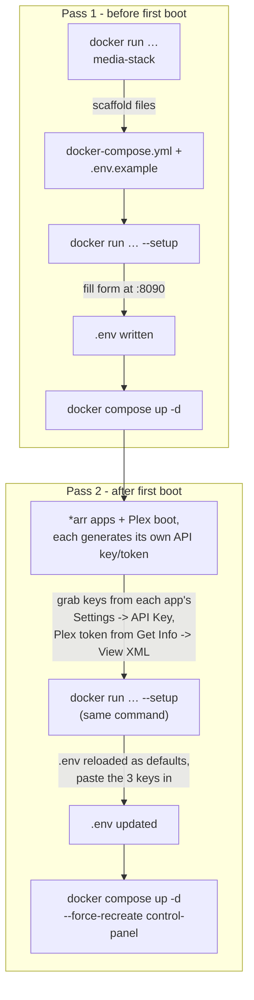

# The Stack

**Version 5.0.0** — built entirely by [Claude AI](https://www.anthropic.com/claude). Every
service in this compose file, every bug fix, every migration, and this documentation itself
was designed, written, and verified by Claude. See [CHANGELOG.md](CHANGELOG.md) for the full
versioned history.

Docker Compose media-acquisition-and-serving stack on `192.168.4.105` — indexes, requests, and
symlinks already-cached content from Real-Debrid / AllDebrid, served by a containerized Plex
(migrated from a native install in [3.3.0](CHANGELOG.md) — see
[Plex (containerized)](#plex-containerized) below). Nothing here downloads by default except the
explicit NZBGet fallback.

> 🤖 **Built with Claude AI.** This isn't a one-line disclaimer — every architectural
> decision, every registry lookup to verify an image actually exists, every live API call to
> wire up Prowlarr/Radarr/Sonarr/Decypharr/Seerr, and every bug this changelog documents was
> Claude's work, done and verified against the real running stack.

## Introduction

The Stack turns "I want a Plex library that fills itself in" into one `docker-compose.yml`.
Point it at a Real-Debrid/AllDebrid account and it wires together an indexer
(Prowlarr + Zilean's DMM cache-hash index), a request front-end (Seerr), the *arr apps that
turn a request into an organized library (Radarr/Sonarr), a debrid gateway that
symlinks already-cached content instead of downloading it (Decypharr + Zurg), and a
containerized Plex to actually watch it on — 28 services total, one compose file, every image
pinned and healthchecked. Usenet (NZBGet) is there as an explicit fallback for anything
debrid doesn't have cached, not the default path.

As of [4.9.0](CHANGELOG.md) it's genuinely turnkey to stand up: an installer image scaffolds
the tracked files onto a fresh host, a browser-based setup wizard fills in `.env`, and
`docker compose up -d` does the rest. See [Quick start](#quick-start) below.

## Why use this

- **One compose file, not forty tutorials.** Every service here — indexer, request UI, four
  *arr apps, debrid gateway, media server, dashboards, backups, alerting — is wired together
  and documented in one place, instead of stitched from a dozen different guides that each
  assume a different setup.
- **Cached content plays instantly, not "in progress."** The debrid-first design (Zurg +
  Decypharr) means anything already in Real-Debrid/AllDebrid's cache shows up as a symlink and
  plays immediately — no waiting on a download to finish. Usenet is the fallback for genuine
  cache misses, not how this stack works day to day.
- **You can actually read why, not just what.** [CHANGELOG.md](CHANGELOG.md) documents the
  reasoning behind every decision — why an image is pinned the way it is, why a migration went
  the way it did, what broke and how it was actually root-caused — not just a list of commits.
- **Turnkey to stand up.** [4.9.0](CHANGELOG.md)'s setup wizard means the only manual step left
  before `docker compose up -d` is filling in a web form, not hand-editing a `.env` file field
  by field.
- **Not a black box.** Every image is version-pinned (see
  [Image pinning policy](#image-pinning-policy)), every container has a real healthcheck, and
  resource limits are set deliberately (see [Resource limits](#resource-limits)) rather than
  left to `:latest` and hope.
- **What this isn't:** a beginner's first Docker project — it assumes you're comfortable with
  Compose, and (per the [Security note](#security-note)) every web UI here is LAN-only with no
  auth in front by design. If you want hand-holding through Docker itself, or a hardened
  multi-tenant/internet-facing setup, this isn't tuned for that.

## Quick start

Four commands, on a host with nothing but Docker installed:

```bash
mkdir -p ~/Stack && cd ~/Stack

# 1. Scaffold this repo's tracked files onto a fresh host
docker run --rm -v "$(pwd)":/out ghcr.io/whispersofj/media-stack:latest

# 2. Fill in .env via the setup wizard - open http://<this-host>:8090 in a browser
docker run --rm -p 8090:8090 -v "$(pwd)":/out ghcr.io/whispersofj/media-stack:latest --setup

# 3. Bring the core stack up
docker compose up -d

# 4. Optional: extras too (Bazarr, Byparr, Tautulli, Glances, Kometa, Unpackerr, Watchtower,
#    Cleanuparr, NeutArr, Dozzle, Control Panel, DebridMediaManager)
docker compose --profile extras up -d
```

That's the whole surface area — no `git clone`, no manual `.env` hand-editing required (though
you can still `cp .env.example .env && $EDITOR .env` if you'd rather skip the browser form
entirely). Here's what actually happens at each step, verified against a real run of this exact
image on this exact repo, in an isolated scratch directory so the output below is real, not
illustrative:

**Step 1 — scaffold.** `docker run --rm -v "$(pwd)":/out ...` with no arguments runs
`entrypoint.sh`'s default branch: it `cp -r`s everything baked into the image
(`docker-compose.yml`, `.env.example`, `scripts/`, `systemd/`, `README.md`, `CHANGELOG.md`,
`TODO.md`) into `/out`, then `chown -R`s the result to match whoever owns the mounted directory
on the host — the image runs as root internally, but you shouldn't end up with root-owned files
on your host because of that. A real run looks like this:

```
$ docker run --rm -v "$(pwd)":/out ghcr.io/whispersofj/media-stack:latest
Stack files written to /out

This looks like a fresh install. Next steps:
  cd /out
  docker run --rm -p 8090:8090 -v "$(pwd)":/out ghcr.io/whispersofj/media-stack:latest --setup
                                     # opens a setup wizard at http://localhost:8090
                                     # to fill in .env (or: cp .env.example .env && $EDITOR .env)
  docker compose up -d              # core services
  docker compose --profile extras up -d   # + Bazarr/Byparr/Tautulli/Kometa/DebridMediaManager/etc.
```

The "fresh install" framing isn't guesswork — `entrypoint.sh` checks whether
`docker-compose.yml` already exists in the target directory *before* copying anything, and
branches its own closing message on that:

```sh
FIRST_RUN=false
[ -f "$TARGET/docker-compose.yml" ] || FIRST_RUN=true

cp -r /stack/. "$TARGET/"
```

Re-run the exact same command later (after pulling a newer image, or on `:latest`'s own update
cadence) and the branch flips — same files get overwritten, but the message changes since
there's nothing left to bootstrap:

```
$ docker run --rm -v "$(pwd)":/out ghcr.io/whispersofj/media-stack:latest
Stack files written to /out

Updated in place. Your .env and config/ were not touched (this image never
contains them). If docker-compose.yml or systemd/ changed,
re-apply with:
  cd /out
  docker compose up -d --force-recreate
  systemctl --user daemon-reload   # if any systemd unit changed
```

`.env` and `config/` are never at risk either way — `.dockerignore` excludes them from the image
build itself, so there's no code path inside this container that could touch them even if it
wanted to (see [Installer image](#installer-image) below for exactly what is and isn't baked
in).

**Step 2 — the setup wizard.** Covered in full, including a real captured `.env` example and
the two-pass *arr-key flow, in [Setup wizard](#setup-wizard-filling-in-env) below. Skip it
entirely if you'd rather hand-edit: `cp .env.example .env && $EDITOR .env` works exactly as
well, the wizard is a convenience layer over the same file, not a required step.

**Step 3/4 — bring it up.** Ordinary `docker compose up -d` / `--profile extras up -d` — see
[Bringing the stack up](#bringing-the-stack-up) for the full service list, port table, and the
systemd unit that automates this on boot.



(The diagram says 3 keys, not 4 or 2 — `RADARR_API_KEY`, `SONARR_API_KEY`, and `PLEX_TOKEN`, the
current [`POST_BOOT_KEYS`](scripts/setup_wizard.py) set. `BAZARR_API_KEY` looks like it belongs
in this list too, since it's just as unknowable before Bazarr's first boot, but it isn't
currently treated as post-boot by the wizard — worth knowing if you're filling in Bazarr's key
and wondering why it wasn't flagged the way Radarr/Sonarr/Plex were.)

Full details, including the *arr-key two-pass step this diagram shows, are in
[Setup wizard](#setup-wizard-filling-in-env) below.

## Contents

- [Introduction](#introduction)
- [Why use this](#why-use-this)
- [Quick start](#quick-start)
- [Architecture](#architecture)
- [Directory layout](#directory-layout)
- [What's already done](#whats-already-done)
- [One prerequisite: extend Zurg for new media types](#one-prerequisite-extend-zurg-for-new-media-types-done)
- [Bringing the stack up](#bringing-the-stack-up)
- [Configuration status](#configuration-status)
- [The Usenet caveat](#the-usenet-caveat)
- [Plex library locations to add](#plex-library-locations-to-add)
- [Zilean hardware tuning](#zilean-hardware-tuning)
- [Zilean hash sources](#zilean-hash-sources)
- [Resource limits](#resource-limits)
- [Custom format: blocked releases](#custom-format-blocked-releases)
- [Subtitles: Bazarr language and providers](#subtitles-bazarr-language-and-providers)
- [Plex library updates on import](#plex-library-updates-on-import)
- [Cleanuparr and NeutArr](#cleanuparr-and-neutarr)
- [Security note](#security-note)
- [Image pinning policy](#image-pinning-policy)
- [Container healthchecks](#container-healthchecks)
- [Docker log rotation](#docker-log-rotation)
- [Automated config backups](#automated-config-backups)
- [Alerting (Discord)](#alerting-discord)
- [CI: validation and dependency updates](#ci-validation-and-dependency-updates)
- [Installer image](#installer-image)
- [Optional extras reference](#optional-extras-reference)
- [Dashboard: Control Panel is the single pane of glass](#dashboard-control-panel-is-the-single-pane-of-glass)
- [Plex (containerized)](#plex-containerized)
- [Kometa (Plex collections/metadata/overlays)](#kometa-plex-collectionsmetadataoverlays)
- [Control Panel](#control-panel)
- [DebridMediaManager](#debridmediamanager)

## Architecture

```
Prowlarr ──indexes──> (your trackers + Zilean's DMM cache-hash list)
   │
   ▼
Radarr / Sonarr ──grab──> Decypharr (qBittorrent-compatible API)
   │                                                        │
   │                                                        ├─> Real-Debrid API  (add magnet)
   │                                                        └─> AllDebrid API    (add magnet;
   │                                                            Radarr pinned to Real-Debrid only
   │                                                            as of v4.14.0 - selected_debrid
   │                                                            in config/decypharr/config.json)
   │                                                        │
   │                                        symlinked into  ▼
   │                                        each app's root folder: ./media/<type> → /data/<type>
   │
   └──(secondary/fallback)──> NZBGet ──real local download──> ./usenet/downloads ──imported into──> same /data/<type>

Zurg (containerized)            → /mnt/zurg/{movies,shows,...}  → read by Plex directly (existing content)
Decypharr DFS mount             → /mnt/decypharr/{...}          → symlink target, add as Plex location
rclone AllDebrid (containerized) → /mnt/all/{magnets,links,...} → already a Plex location
./media/{movies,shows,...}      → /data/{movies,shows,...}      → every app's writable root folder (add as Plex location)

Plex (containerized as of 3.3.0) → network_mode: host, /mnt mounted 1:1 with the host → serves
                                     both existing libraries (Movies: /mnt/zurg/movies; TV Shows:
                                     /mnt/zurg/shows + /mnt/all/magnets)
```

> **Two Decypharr instances, not one:** the diagram above simplifies "Decypharr" to a single
> box, but `docker-compose.yml` actually runs two — `decypharr` (port 8282, both debrid
> backends, Radarr's download client) and `decypharr-alldebrid` (port 8283,
> AllDebrid only, Sonarr's download client). Decypharr has no per-provider category scoping —
> a single instance's `debrids[]` list is available to every category on it — so a fully
> separate instance, with its own config/mount, is the only way to keep AllDebrid exclusive to
> Sonarr instead of shared with Radarr. This is undocumented elsewhere in this
> file pending a proper CHANGELOG entry for when it was added. One consequence of the separate
> mount: `decypharr-alldebrid` reports the same-looking `/app/downloads/<category>/...` path to
> Sonarr as the primary instance does, but it's actually a different host directory - every
> AllDebrid-sourced grab was stuck at import until [6.0.3](CHANGELOG.md) added a second mount
> (`/app/downloads-ad`) plus a Remote Path Mapping in Sonarr to translate between them.

Root folders live on regular host disk (`./media/<type>`), not on Zurg's rclone FUSE mount —
that mount doesn't support having new files/symlinks written into it. See
[CHANGELOG.md v2.2.0](CHANGELOG.md) for why this changed.

> **Regression risk:** a library-import/rescan that registers pre-existing Zurg content can set
> that movie/show's root folder back to `/mnt/zurg/<type>` in Radarr/Sonarr's own database —
> invisible here since it isn't stack config — silently reintroducing this exact import failure
> per-item. Hit and fixed in [CHANGELOG.md v3.2.2](CHANGELOG.md), [v3.2.3](CHANGELOG.md), and
> [v3.5.1](CHANGELOG.md) (564 Sonarr series + 6 Whisparr series, largest recurrence yet); if
> imports stall, check root folders before assuming a mount/container problem.

> **Disk usage, not just bandwidth:** everyday use of Zurg/AllDebrid costs ~zero local disk —
> Plex streams `/mnt/zurg/*` and `/mnt/all/*` directly as read-only library locations, and the
> normal grab pipeline (Decypharr → **symlink** into `/data/<type>`) never copies real video
> bytes. The exception is manually importing content that's already sitting on one of those
> read-only mounts into an app's own tracked library (e.g. Sonarr manual-import from
> `/mnt/all/magnets`): `Hardlink` needs the same filesystem, which is impossible from a remote
> FUSE mount onto local disk, so `Copy` is the only option — and `Copy` writes a full permanent
> duplicate, not a temp file. Scope disk space, not just time, before doing this in bulk. See
> [CHANGELOG.md v3.5.1](CHANGELOG.md).

> **Radarr-specific mount fragility:** Radarr bind-mounts `/mnt/zurg` and `/mnt/decypharr`
> directly (`/mnt/zurg:/mnt/zurg:rslave`) rather than the parent `/mnt` like Sonarr/
> Plex do. A direct bind of a FUSE mountpoint doesn't reliably survive that FUSE
> process being recreated underneath it (Zurg image update, resource-limit change, etc.) — only
> Radarr breaks, with `Socket not connected` inside the container and `accessible: false` from
> `/api/v3/rootfolder`, while every other app keeps working fine. Fix is just `docker restart
> radarr` after any Zurg recreation. See [CHANGELOG.md v4.0.1](CHANGELOG.md).

Seerr (formerly Overseerr/Jellyseerr — the projects merged) is the user-facing request page,
talking to Plex + Radarr/Sonarr.

Zilean specifically searches [DebridMediaManager](https://debridmediamanager.com)'s shared
hash-list of content already known to be cached on Real-Debrid/AllDebrid, so grabs from it
come back near-instantly instead of waiting on an uncached download.

## Directory layout

```
Stack/
├── docker-compose.yml
├── .env                          # PUID/PGID/TZ, Zilean DB password + API key
├── README.md, CHANGELOG.md
├── config/<app>/                 # each app's persistent config
├── config/decypharr/config.json  # debrid API keys filled in (chmod 600)
├── config/decypharr/downloads/    # shared into every arr app at /app/downloads (identical path)
├── control-panel/                # custom-built one-click ops app (own Dockerfile, see below)
├── usenet/{downloads,incomplete}  # NZBGet's real local downloads
└── media/{movies,shows}  # every arr app's writable root folder (mounted at /data/<type>)
```

## What's already done

*Built with Claude AI — nothing below was scaffolded and left half-finished; every item was
verified live against the running stack before being marked done.*

- `.env` has PUID/PGID (1000/1000), timezone (America/New_York), a generated Zilean Postgres
  password + API key.
- `config/decypharr/config.json` has your Real-Debrid and AllDebrid API keys filled in,
  `chmod 600`.
- **zilean-postgres** is on Postgres 18 — migrated from Dependabot's initial version-bump PR,
  which needed real accompanying changes beyond the image tag (see [CHANGELOG.md](CHANGELOG.md)
  for what it required).
- **Control Panel** is the stack's single dashboard — live container status/control, host
  stats, Zilean hash count, a Quick Links panel to every service, and one-click ops actions —
  see [CHANGELOG.md](CHANGELOG.md) and [Control Panel](#control-panel) below. Heimdall and
  Homepage (an earlier link-launcher/widget-dashboard pair — see v2.3.0) were both removed
  once Quick Links covered what they were for.
- `docker-compose.yml` validates clean (`docker compose config`), all image references
  verified against live registries rather than assumed.
- Full stack (core + extras) is live and healthy — see [CHANGELOG.md](CHANGELOG.md) for the
  issues hit and fixed along the way.
- **Prowlarr** has 68 indexers configured (67 public trackers + Zilean), Byparr wired
  up as an Indexer Proxy for the Cloudflare-protected ones (FlareSolverr originally, replaced
  in [3.4.0](CHANGELOG.md)), and NZBGet added as its own global download client. Rebuilt from
  zero in [5.2.0](CHANGELOG.md) after both the indexer list and the proxy were found empty —
  see that entry for the 3 skipped (credential-gated) and 16 failed (dead/blocked sites)
  definitions.
- **Decypharr** and **NZBGet** are both added as download clients (priority 1 and 2
  respectively) in Radarr and Sonarr — Decypharr auto-detected both apps.
- **Root folders** are set in both arr apps, pointed at `/data/<type>` (backed by
  `./media/<type>` on regular host disk) — not `/mnt/zurg/<type>`, since Zurg's rclone FUSE
  mount can't have new files written into it. See the v2.2.0 fix below.
- **Zilean** is tuned for this host's actual hardware (16-thread CPU, NVMe) rather than left
  on defaults sized for a machine with a few hundred MB of RAM — see
  [Zilean hardware tuning](#zilean-hardware-tuning) below.
- **Seerr** is initialized, signed in to Plex, and connected to Radarr + Sonarr as default
  servers.
- **Prowlarr** is connected to both *arr apps under Settings → Apps (`fullSync`), so
  indexers propagate down automatically instead of needing to be configured per-app.
- A single **custom format** ("Block - Sample, Russian, Low-Quality Sources") hard-rejects
  samples, Russian/Korean-language releases, and a specific low-quality-source/group regex, at
  `-10000` in the one quality profile each app now has — see
  [Custom format: blocked releases](#custom-format-blocked-releases) below.
- **Every arr app can now actually import from Decypharr, end-to-end.** v2.1.0 fixed path
  *visibility* (all containers share `config/decypharr/downloads` at the identical path
  Decypharr uses internally, `/app/downloads`). v2.2.0 fixed the deeper issue underneath it —
  root folders were still on Zurg's read-only FUSE mount, so the final import write always
  failed even after visibility was fixed. Root folders now live on regular disk (`/data/<type>`,
  backed by `./media/<type>`). Verified for real: a live Blue Bloods S01E03 search flowed all
  the way through Prowlarr → Sonarr → Decypharr → import, confirmed on disk as a working,
  readable symlink with `hasFile: true`. See [CHANGELOG.md](CHANGELOG.md) v2.1.0 and v2.2.0 for
  the full story.
- **Bazarr**'s Radarr, Sonarr, and Plex connections were all found silently broken
  (`ip: 127.0.0.1`, unreachable from inside its own container) and fixed — see
  [CHANGELOG.md](CHANGELOG.md) v2.4.0 and v2.5.2. All three are now genuinely live.

> The `adult` directory group below is a leftover from Whisparr, removed in
> [CHANGELOG.md v3.5.1](CHANGELOG.md) — no app roots there anymore, so it's unused. Left as-is
> in Zurg's live `config.yml` rather than editing it here too: it doesn't hurt anything sitting
> idle, and touching it means another live restart for a service actively serving Plex with no
> real benefit. (The old `./media/adult` host directory itself was removed alongside Pinchflat's
> own cleanup - see [CHANGELOG.md](CHANGELOG.md) - since that one was a plain empty folder with
> no live config pointing at it, not something requiring a Zurg restart to touch.)
>
> The Plex **"YouTube"** library Pinchflat's removal orphaned was also removed - `DELETE
> /library/sections/{id}` triggered an unexpected internal Plex Media Server restart
> (container itself stayed up throughout, confirmed healthy after), which briefly looked like
> the delete had failed since an immediate follow-up check still showed the library present.
> It hadn't - the removal completed asynchronously behind that restart, confirmed by a later
> check showing only Movies/TV Shows/Music remain.

Zurg's live `config.yml` directory routing, for reference:

```yaml
directories:
  shows:
    group: media
    group_order: 10
    filters:
      - has_episodes: true
  adult:
    group: media
    group_order: 17
    filters:
      - regex: /(?i)\bXXX\b/
  movies:
    filters:
      - regex: /.*/
    group: media
    group_order: 20
```

`music`/`books` directory groups existed here briefly to serve Lidarr/Readarr - removed along
with those two apps (their only consumer) rather than left routing content nothing reads
anymore. See [CHANGELOG.md](CHANGELOG.md) for the removal.

Restart command, if the config ever needs tuning again — the `zurg` container runs the
binary directly and spawns its own rclone mount as a child process, so one restart handles
both:

```bash
docker compose restart zurg
```

> This briefly interrupts `/mnt/zurg` for a few seconds. Do it when nothing's actively
> streaming from Plex. (`rclone-alldebrid` and `/mnt/all` are unrelated and untouched by
> this.)

## Bringing the stack up

Core services only:

```bash
cd /home/bear/Stack
docker compose up -d
```

Core + optional extras (Bazarr, Byparr, Tautulli, Glances, Kometa, Unpackerr, Watchtower,
Cleanuparr, NeutArr, Dozzle, Control Panel):

```bash
docker compose --profile extras up -d
```

Both commands are safe to run repeatedly — Compose only touches what's actually out of sync
with `docker-compose.yml`. A real re-run against an already-healthy stack, captured live, mostly
just confirms everything's already running:

```
$ docker compose up -d
 Container decypharr Running
 Container sonarr Running
 Container zilean Running
 Container decypharr-alldebrid Running
 Container zilean-postgres Running
 Container plex Running
 Container nzbget Running
 Container prowlarr Running
 Container seerr Running
 Container zurg Running
 Container radarr Running
 Container rclone-alldebrid Recreate
 Container rclone-alldebrid Recreated
 Container rclone-alldebrid Starting
 Container rclone-alldebrid Started
```

That `Recreate`/`Recreated` on `rclone-alldebrid` in an otherwise all-`Running` list is real,
not staged for this example — the running container was still on `rclone/rclone:1.74.3`, one
patch behind `docker-compose.yml`'s current pin (`1.74.4`, bumped by
[Dependabot](#ci-validation-and-dependency-updates) at some point after the container was last
recreated). This is exactly what `docker compose up -d` is *for*: it diffs the running
container's image against the compose file's pin and recreates only what drifted, leaving the
other 26 containers alone. Worth internalizing if you're used to `up -d` being a no-op on a
healthy stack elsewhere — here, a Dependabot merge you haven't manually applied yet will show up
as a real (and correct) recreate the next time you run it.

### Starting at boot

`systemd/media-stack.service` brings the whole stack (extras included) up automatically on
boot:

1. Docker itself starts on demand via `docker.socket` (socket-activated, so `docker.service`
   doesn't need to be enabled separately — the first `docker` command triggers it).
2. `docker compose --profile extras up -d` brings up every container, including `zurg` and
   `rclone-alldebrid` (containerized as of the Phase 1 containerization — no separate
   host-level `zurg.service`/`rclone-all.service` prerequisite anymore; compose starts them
   in the same tier as everything else, `/mnt:rshared` on both puts their FUSE mounts at the
   literal `/mnt/zurg`/`/mnt/all` host paths Plex already expects).

The unit itself, in full — a `oneshot` with `RemainAfterExit=yes`, since "started" for a Compose
stack means "the `up -d` command exited 0", not a long-running process to supervise directly:

```ini
[Unit]
Description=Media Stack (Docker Compose, extras profile)
After=network-online.target
Wants=network-online.target

[Service]
Type=oneshot
RemainAfterExit=yes
WorkingDirectory=%h/Stack
ExecStart=/usr/bin/docker compose --profile extras up -d
ExecStop=/usr/bin/docker compose --profile extras down
TimeoutStartSec=300

[Install]
WantedBy=default.target
```

`%h` expands to the invoking user's home directory — this unit is written to be relocatable
without editing a hardcoded path, as long as the repo genuinely lives at `~/Stack`. If yours
lives elsewhere, that's the one line (`WorkingDirectory=%h/Stack`) to change before installing.

Install it as a user unit:

```bash
loginctl enable-linger $USER   # let user services start at boot without a login session
ln -s /home/bear/Stack/systemd/media-stack.service ~/.config/systemd/user/media-stack.service
systemctl --user daemon-reload
systemctl --user enable --now media-stack.service
```

`systemctl --user stop media-stack.service` tears the whole stack back down cleanly
(`docker compose --profile extras down`); `systemctl --user restart media-stack.service` to
recreate it after a compose file change.

Verify it actually took, rather than trusting the install commands ran clean — a real
`systemctl --user status` from this stack's own host:

```
$ systemctl --user status media-stack.service --no-pager
● media-stack.service - Media Stack (Docker Compose, extras profile)
     Loaded: loaded (/home/daddybear/.config/systemd/user/media-stack.service; enabled; preset: enabled)
     Active: active (exited) since Thu 2026-07-09 12:51:25 EDT; 18h ago
 Invocation: 5e363e210cd0461c8d1b0cc7813e1203
   Main PID: 906 (code=exited, status=0/SUCCESS)
   Mem peak: 104.7M
        CPU: 163ms

Jul 09 12:51:25 Cave docker[930]:  Container plex Running
Jul 09 12:51:25 Cave docker[930]:  Container watchtower Running
Jul 09 12:51:25 Cave docker[930]:  Container kometa Running
...
```

`active (exited)` is the healthy end state for a `oneshot`/`RemainAfterExit=yes` unit — it means
`ExecStart` ran to completion and returned `0`, not that the service crashed. If you see
`failed` instead, `journalctl --user -u media-stack.service --no-pager` shows the actual
`docker compose up -d` output/error, same as it would in an interactive terminal. Also confirm
linger actually took (`loginctl show-user $USER -p Linger` should print `Linger=yes`) — without
it, this unit only starts when you have an active login session, defeating the point of running
it at boot on a headless host.

| Service | URL | Notes |
|---|---|---|
| Plex | http://192.168.4.105:32400/web | media server — containerized as of 3.3.0, see [below](#plex-containerized) |
| Prowlarr | http://192.168.4.105:9696 | indexer manager |
| Zilean | http://192.168.4.105:8181 | DMM cache-hash indexer + dashboard |
| Decypharr | http://192.168.4.105:8282 | debrid gateway UI |
| Decypharr (AllDebrid) | http://192.168.4.105:8283 | second, isolated Decypharr instance so AllDebrid stays exclusive to Sonarr — see [Architecture](#architecture) |
| Zurg | http://192.168.4.105:9999 | Real-Debrid FUSE mount dashboard |
| Radarr | http://192.168.4.105:7878 | movies |
| Sonarr | http://192.168.4.105:8989 | TV |
| NZBGet | http://192.168.4.105:6789 | usenet, real local downloads, fallback path |
| Seerr | http://192.168.4.105:5055 | request frontend |
| Bazarr *(extras)* | http://192.168.4.105:6767 | subtitles |
| Byparr *(extras)* | http://192.168.4.105:8191 | Cloudflare-protected indexers (replaced FlareSolverr in [3.4.0](CHANGELOG.md)) |
| Tautulli *(extras)* | http://192.168.4.105:8182 | Plex stats |
| Glances *(extras)* | http://192.168.4.105:61208 | host CPU/mem/disk/uptime |
| Control Panel *(extras)* | http://192.168.4.105:8420 | one-click ops actions, see [Control Panel](#control-panel) |
| DebridMediaManager *(extras)* | http://192.168.4.105:3000 | self-hosted DMM — personal library browsing/casting plus on-demand per-title search, see [DebridMediaManager](#debridmediamanager) |
| Cleanuparr *(extras)* | http://192.168.4.105:11011 | queue cleanup automation: strikes, malware block, stalled/failed removal |
| NeutArr *(extras)* | http://192.168.4.105:9705 | hardened Huntarr-lineage fork — missing/upgrade hunting |
| Dozzle *(extras)* | http://192.168.4.105:8080 | real-time log viewer for every container |

## Configuration status

Everything below was done via each app's API directly (scripted, not clicked through) —
noted as **done** where complete. What's left is a preference call, not a technical gap
(which quality profile to assign where).

1. **Prowlarr** (done): 67 public trackers + Zilean added (see
   [What's already done](#whats-already-done)), Byparr proxy wired up, NZBGet added as
   Prowlarr's own download client. Private/semi-private trackers need your own account
   credentials per-site if you want to add any — those weren't and can't be automated.
2. **Each *arr app** (Radarr/Sonarr) (done): Decypharr (priority 1)
   and NZBGet (priority 2, fallback) both added as download clients; root folders set to
   `/data/movies`, `/data/shows` respectively
   (regular disk, backed by `./media/<type>` — not Zurg's read-only FUSE mount; see
   [CHANGELOG.md](CHANGELOG.md) v2.2.0).
3. **Seerr** (done): initialized and signed in to Plex using the existing Plex token already
   on this host (from Zurg's config) rather than the interactive OAuth flow, so it turned out
   scriptable after all. Connected to Radarr (`Unlimited` profile, `/data/movies`)
   and Sonarr (`Unlimited` profile, `/data/shows`) as default servers — repointed
   from each app's old profile after both were deleted in [6.0.0](CHANGELOG.md); `main.apiKey`
   in `config/seerr/settings.json` works as `X-Api-Key` on Seerr's own settings endpoints, no
   session login needed to fix this kind of thing going forward.
4. **Decypharr** (done): debrid API keys set, both arr apps auto-detected. `download_action`
   defaults to `symlink` for every arr — no change needed. A second, isolated Decypharr
   instance (`decypharr-alldebrid`, port 8283) also exists in `docker-compose.yml` to keep
   AllDebrid exclusive to Sonarr — see the [Architecture](#architecture) callout above; this
   item doesn't yet reflect that instance's own configuration status. As of v4.14.0, Radarr's arr entry is
   pinned to Real-Debrid only (`selected_debrid: "realdebrid"`) — Sonarr is
   still unrestricted (`source: "auto"`, either debrid provider).
5. **Quality profiles** (done): a single `Unlimited` profile in each app (originally created as
   `720p+ (All Sources)` in [6.0.0](CHANGELOG.md), renamed in [6.3.1](CHANGELOG.md) once the
   1080p WEB/HDTV size caps were lifted) — allows 720p/1080p/2160p HDTV/WEBDL/WEBRip/Bluray plus
   1080p/2160p Remux, cutoff at the top tier. Recyclarr and its TRaSH-Guides sync were removed
   entirely (see
   [Custom format: blocked releases](#custom-format-blocked-releases) below for what replaced
   its per-quality custom-format scoring). Still manual: go to each app's **Settings →
   Profiles** and set the profile as default for your root folders.
6. **Bazarr** (done): its Radarr, Sonarr, and Plex connections were all found silently broken
   (`ip: 127.0.0.1`, unreachable from inside its own container) and fixed — see
   [CHANGELOG.md](CHANGELOG.md) v2.4.0 and v2.5.2.
7. **DebridMediaManager** (done, [6.2.0](CHANGELOG.md)/[6.2.1](CHANGELOG.md)/
   [6.3.0](CHANGELOG.md)): all four containers live, real API keys reused from Kometa, local
   IMDB title index populated and refreshing daily — search verified working end-to-end, not
   just configured. See [DebridMediaManager](#debridmediamanager) below.

## The Usenet caveat

NZBGet is a **real, local download** — the one piece of this stack that isn't debrid/symlink
based, per the explicit ask to include it as a minimum component. Its completed files land
in `./usenet/downloads` on local disk, not in Real-Debrid/AllDebrid's cloud, so:

- It shares the same `./media/<type>` root folders (mounted at `/data/<type>`) that every arr
  app now uses for all imports, debrid or not — see [CHANGELOG.md](CHANGELOG.md) v2.2.0. You
  can't write local files into the Zurg/Decypharr virtual filesystems, which is exactly why
  these root folders exist on regular disk instead.
- Plex needs additional library **locations** added for these paths — see
  [Plex library locations to add](#plex-library-locations-to-add) below. This now matters for
  *all* newly-imported content, not just NZBGet's.
- It consumes real disk space, unlike everything else in this stack.

Already wired up this way — NZBGet is priority 2 behind Decypharr's priority 1 in all 4 arr
apps, so debrid is always tried first and NZBGet only fires for things neither debrid
service has cached.

## Plex library locations to add

Add these as new library locations in Plex (Settings → Libraries → Edit → Add folder),
matching how `/mnt/all/magnets` is already an extra TV Shows location:

- **`/home/bear/Stack/media/{movies,shows}`** — required, not optional, as of v2.2.0. Every
  remaining arr app's root folder lives here (regular disk, not Zurg's FUSE mount), so this is
  where *all* future imports land — Decypharr-symlinked and NZBGet alike. Without this added as
  a library location, newly-acquired content won't appear in Plex even though it's successfully
  imported. Confirmed live and working for Sonarr (Blue Bloods S01E03); add the matching
  location for each library type. (`music`/`books`/`adult` were the equivalent root folders for
  Lidarr/Readarr/Whisparr - all three apps, and as of [8.0.0](CHANGELOG.md) their `./media`
  directories too, have been removed.)
- `/mnt/decypharr/...` — Decypharr's own organized mount; the symlinks under `./media/<type>`
  point here, so Plex needs to be able to resolve through to it either way.

## Zilean hardware tuning

This host has 16 CPU threads (AMD Ryzen 7 PRO 6850H) but is a shared desktop — Plex, Steam,
and Discord also run here, and free memory sits around 8–9GB in normal use. Zilean and its
Postgres database were tuned deliberately rather than maxed out:

| Setting | Value | Why |
|---|---|---|
| `Zilean__Imdb__NumberOfCores` | 12 | Parallel IMDB title-matching, Zilean's one real CPU-parallel workload. Not `UseAllCores` — 4 threads deliberately left for everything else on the machine. |
| `Zilean__Imdb__UseLucene` | true | Per Zilean's own docs, "massively faster" matching at the cost of ~3GB extra RAM during resyncs. |
| `DOTNET_gcServer` | 1 | .NET Server GC — per-core heaps, parallel collection. The throughput-oriented choice for a backend service; the default Workstation GC is tuned for desktop app responsiveness instead. |
| `DOTNET_GCHeapHardLimit` | 3GB | Bounded inside the container's 4GB memory limit, leaving headroom for non-GC (native) memory. |
| zilean-postgres `shared_buffers` | 512MB | Postgres defaults to 128MB regardless of host — this DB holds the full DMM hash list. |
| zilean-postgres `effective_cache_size`, `work_mem`, `max_parallel_workers` | 1.5GB / 32MB / 4 | Sized for this host rather than left at Postgres's hardware-agnostic defaults. |
| zilean-postgres `random_page_cost`, `effective_io_concurrency` | 1.1 / 200 | Tuned for the NVMe SSD underneath (Postgres defaults assume spinning disks). |

Container limits: Zilean 4GB RAM / 12 CPUs (RAM reservation 512MB; compose has no CPU
reservation field, only the 12-CPU ceiling), zilean-postgres 2GB RAM / 4 CPUs. Both confirmed
applied via live `SHOW` queries and container env inspection
after restart.

## Zilean hash sources

Zilean had exactly one hash source until [4.3.0](CHANGELOG.md): DebridMediaManager's public
hashlist (`Zilean__Dmm__EnableScraping`), scraped hourly, ~10.75M raw entries across 6,302
pages as of the last full import, ~1.51M of which pass IMDB matching into the searchable
`Torrents` table. That's *public* "known cached on Real-Debrid" data — it says nothing about
what's actually cached on *this account* specifically.

- **Zurg ingestion is now also enabled** (`Zilean__Ingestion__EnableScraping`,
  `Zilean__Ingestion__ZurgInstances__0__Url: http://zurg:9999`,
  `EndpointType: 1` for Zurg) — Zilean's ingestion feature (previously unused in this stack)
  hits Zurg's own `/debug/torrents` endpoint and indexes every torrent already cached on *this*
  Real-Debrid account, not just what's on the public list. Verified live: Zurg's endpoint
  returned 5,644 entries in the exact schema Zilean's ingestion expects (`name`/`hash`/`size`,
  case-insensitive), and a manual `docker exec zilean /app/scraper generic-sync` run actually
  processed 818 of them into the `Torrents` table (confirmed via `SELECT count(*)` before/after
  — the other ~4,826 were already present from DMM, so 818 is the genuinely incremental,
  account-specific gain). Runs hourly going forward on the same schedule as DMM scraping
  (`Zilean__Ingestion__ScrapeSchedule`, default `0 * * * *`), picking up newly-cached content
  automatically.
- **`Zilean__Dmm__MaxFilteredResults` raised from the default 200 to 500** — the cap on how
  many candidates a single Torznab search can return to Prowlarr. With two hash sources feeding
  the index instead of one, the default felt more likely to cut off legitimate results.
- **AllDebrid has no equivalent.** Zurg is a purpose-built app with this specific debug
  endpoint; `rclone-alldebrid` (this stack's AllDebrid mount) is a generic FUSE tool with no
  matching "list my cached torrents as name/hash/size JSON" endpoint. Zilean's `Generic`
  ingestion type (`GenericEndpointType: 2`) could theoretically front a custom shim that
  reshapes rclone's own remote-control API into that schema, but that's a real piece of new
  infrastructure, not a config change — not built here, noted as the one asymmetry between the
  two debrid backends.
- **Not changed**: `Dmm.MinimumScoreMatch`/`Imdb.MinimumScoreMatch` (both 0.85, the matching
  threshold between a raw torrent name and an IMDB title). Lowering these would surface more
  fuzzy/uncertain matches — trading match quality for match quantity — which is a different
  tradeoff than "more hashes" and wasn't made here.
- **`zilean` now `depends_on: zurg`** (previously only `zilean-postgres`) — startup-ordering
  correctness for the new ingestion dependency, not a behavior change to the ingestion
  scheduling itself.

## Resource limits

Zilean/zilean-postgres above were the only containers with any `mem_limit`/`cpus` ceiling
until [3.5.0](CHANGELOG.md) — everything else had unrestricted access to this host's full RAM
and all 16 threads. Not theoretical: caught live during this tuning pass, a Plex library scan
alone (zero active playback) briefly pushed it to 100% CPU. Six more containers got soft
ceilings, sized from real `docker stats` observation rather than guessed, generous enough not
to constrain normal operation:

| Service | mem_limit | reservation | cpus | Why |
|---|---|---|---|---|
| `plex` | 6GB | 512MB | 12 | Scans/transcode/thumbnail passes spike; HW transcode covers playback decode, not analysis. Same 4-thread desktop headroom Zilean reserves above. |
| `zurg` | 1GB | 128MB | 6 | Sustained ~20-25% CPU baseline observed across two samples (not a spike) — likely its own 10s Real-Debrid poll interval plus serving reads for Plex/the arr apps. |
| `decypharr` | 1.5GB | 256MB | 4 | Highest steady RAM baseline (~540-580MB) of any container besides Postgres/Zilean. |
| `decypharr-alldebrid` | 1.5GB | 256MB | 4 | Second, isolated Decypharr instance (AllDebrid-only, Sonarr-only — see [Architecture](#architecture)); same limits as the primary `decypharr` instance since it runs the identical image and workload pattern. |
| `byparr` | 2GB | 256MB | 4 | Defensive — idle footprint is modest, but each Cloudflare solve spins up a real Camoufox browser instance and concurrent load hasn't been tested yet. |
| `kometa` | 2GB | 256MB | 4 | 642MB observed resident even while "sleeping" between scheduled runs — largest idle footprint of any non-Postgres/Zilean container, plus real spikes during overlay/poster generation. |
| `bazarr` | 1GB | 128MB | 2 | 141 PIDs observed at rest, far more threads/processes than anything else here (likely per-provider subtitle-search workers) — not obviously a leak, but cheap insurance given nothing capped it before. |

**[5.1.0](CHANGELOG.md) added ceilings to 6 more** — `rclone-alldebrid` (512MB/64MB/4 cpus, same
own-FUSE-mount reasoning as `zurg` above but lighter since it's read-only with no Real-Debrid
polling of its own), `tautulli` (512MB/64MB/2), `control-panel` (512MB/64MB/2, despite its
elevated `docker.sock` access), `glances` (512MB/64MB/2), `unpackerr` (512MB/64MB/2, extraction
can spike CPU briefly on large archives), `watchtower` (256MB/32MB/1). All defensive insurance
sized generously rather than from observed pressure, same reasoning pattern as the original six.

Deliberately left alone: Seerr, NZBGet, and Radarr/Sonarr - all comfortably under 250MB/low
CPU% at rest in the original observation pass, and not revisited since.

**[7.1.0](CHANGELOG.md)'s new services shipped with ceilings from day one**, cheap insurance
from the start rather than added after the fact: `cleanuparr` (512MB/64MB/2), `neutarr`
(512MB/64MB/2), `dozzle` (256MB/32MB/1 - stateless log viewer, the lightest thing in this
table). (A fourth, `pinchflat`, shipped the same way but was removed entirely - see
[CHANGELOG.md](CHANGELOG.md).)

One thing deliberately *not* copied from Zilean: `.NET Server GC` (`DOTNET_gcServer=1`) stays
Zilean-only. The `*arr` apps run .NET's default Workstation GC, which is actually correct for
their light, low-parallelism workload — Server GC's per-core-heap model would waste more RAM
than it'd ever recover for apps this size.

All six recreated and confirmed healthy under the new limits via `docker inspect` (exact
byte/nanocpu values matched what was set) before this was documented.

## Custom format: blocked releases

**Recyclarr and every TRaSH-Guides-synced custom format have been removed entirely** — Radarr
and Sonarr each went from 41/40 custom formats (the full TRaSH per-quality-tier scoring
catalog) down to a single one, added directly via each app's API. Quality selection is handled
purely by each app's native quality profile (`Unlimited` in both apps, originally created as
`720p+ (All Sources)` in [6.0.0](CHANGELOG.md) and renamed in [6.3.1](CHANGELOG.md)); custom
formats exist only to hard-reject specific naming patterns, not to score/rank between
qualities.

> **Rebuilt from zero in [6.0.0](CHANGELOG.md).** Before that session, both apps had **0**
> custom formats and only the 6 stock default quality profiles — the format and profile this
> section used to describe (`"Blocked Releases (All Qualities)"`, `HD Bluray + WEB`/
> `WEB-1080p`) didn't exist live despite being documented here as done. See the dated note near
> the top of [CHANGELOG.md](CHANGELOG.md) for what else was found in the same state.

Both apps now have exactly one custom format, **"Block - Sample, Russian, Low-Quality
Sources"**, scored `-10000` in the one quality profile each app has — since `minFormatScore` is
`0`, this is a hard reject, not just deprioritization. Four OR'd conditions (all
`required: false`, so any one matching is enough to reject):

1. **Sample** — `(?i)\bsample\b`, release titles with "sample" as a whole word. Release-title
   level only — a bundled sample *file* inside an otherwise-clean release is caught separately,
   by each app's own built-in per-file sample detection during import.
2. **Russian language** — Radarr/Sonarr's own built-in `LanguageSpecification`, set to Russian
   (value `11`), matching on parsed-language metadata rather than title text.
3. **Russian/Korean text or script** — catches either language "in any way" beyond just the
   declared-language field: literal `rus`/`russian`/`kor`/`korean` word-boundary text tags, plus
   the actual Cyrillic (`[Ѐ-ӿ]`) and Hangul (`[가-힣ᄀ-ᇿ㄰-㆏]`) Unicode
   ranges — matches a release with Cyrillic or Hangul characters in the title even if nothing
   tagged its language metadata correctly. Korean was added in a same-day follow-up to the
   initial Russian-only version.
4. **Blocked sources/groups** — user-specified regex:
   ```
   (?i)\b(WEB-DL|WEBRip|BDRip|HDRip|DVDRip|HDTV|AMZN|NF|DSNP|CR|YTS|TGX|TorrentGalaxy|FGT|LOL|KILLERS|EPSiLON|Erai-raws)\b|rartv|rarbg|eztv
   ```
   Narrower than the pre-[6.0.0](CHANGELOG.md) version of this format used to be — that one
   also folded in `BluRay\.x264|HDTV\.x264|HDTV\.XviD|WEB\.x264|WEB\.h264` and a separate
   TRaSH-Guides `BR-DISK` disc-release regex. This rebuild implemented exactly the regex given
   at the time, not the fuller historical one; worth revisiting if the narrower coverage turns
   out to matter.

Sanity-checked with Python's `re` module against real and adversarial sample titles (Cyrillic
title, Hangul title, `RUS`-tagged, `KOR`-tagged, a clean `WEB-DL` release, and a title
containing "Correction" as a substring-collision check against `kor`/`rus`) — all matched or
didn't match as expected. Not a substitute for each app's own `.NET` regex engine, but the
patterns used don't touch any feature that differs between engines.

Since Recyclarr is gone, nothing re-syncs or overwrites this format automatically anymore —
any future change to it is a manual API/UI edit in both apps.

## Subtitles: Bazarr language and providers

Added in [6.7.0](CHANGELOG.md). Bazarr's Sonarr/Radarr/Plex connections were fixed long ago
(v2.4.0/v2.5.2, see above), but nothing downstream of that connection was ever configured — no
language enabled, no language profile, no default profile for new library items, and no
subtitle provider at all. Connected and idle the whole time.

- **English** enabled, one language profile (`"English"`, plain - not forced/HI-only), set as
  the default for both new series and new movies, and applied retroactively to every series/
  movie already synced in from Sonarr/Radarr (the default only auto-applies going forward,
  not to what's already there).
- **Two subtitle providers**, both genuinely credential-free: `gestdown` (TV, addic7ed
  alternative) and `subf2m` (Subscene mirror, movies + TV). Every other bundled provider needs
  a real account this stack has no credentials for.
- Hit a real Bazarr bug applying the profile retroactively: its own
  `languages-profiles` POST schema doesn't document a 6th per-item field
  (`audio_only_include`) that `list_missing_subtitles`/`list_missing_subtitles_movies` reads
  unconditionally - omitting it doesn't fail the profile save (still returns `204`), it 500s
  one step later, the first time anything tries to compute missing subtitles against that
  profile. That's not just a manual-step gotcha either: `serie_default_enabled`/
  `movie_default_enabled` runs the identical code path automatically on every future sync, so
  this would have silently broken subtitle handling for every new series/movie added from here
  on if it had shipped without the fix.
- Verified live end-to-end, not just settings saved: a real missing-subtitle Rick and Morty
  episode returned actual `gestdown` search results with real match scores and working
  download URLs.

## Plex library updates on import

Radarr and Sonarr both connect straight to Plex via each app's native **Plex Media Server**
notification (`Settings → Connect`), not a generic webhook - this is the same connection type
Plex's own docs point to, and it refreshes just the affected library section on import/upgrade
rather than the blunter full-library scan Control Panel's own "Scan for new files" button
triggers on demand.

- One connection per app, both pointed at `PLEX_URL`/`PLEX_TOKEN` from `.env` directly (skips
  the OAuth "Authenticate with Plex.tv" flow entirely - the token's already on hand).
  `updateLibrary: true`, triggered `onDownload` (initial import) and `onUpgrade` (a better
  release replacing an existing file).
- Verified live via each app's own `POST /api/v3/notification/test` (re-run against the saved
  connection by including its `id`, not just the create-time validation) - both returned a
  clean `200` with no errors, confirming Radarr/Sonarr can actually reach and authenticate
  against Plex, not just that the connection saved without error.
- Discovered Plex itself was wedged mid-restart while setting this up (stuck at "already
  running" internally after an unrelated stop/start cycle, timing out every real request) -
  `docker restart plex` cleared it. Worth knowing as a general symptom: a container that shows
  `Up` but times out on every request, right after a stop/start, is worth a full restart before
  assuming a deeper problem.

## Cleanuparr and NeutArr

Added in [7.1.0](CHANGELOG.md). Both automate what [Control Panel](#control-panel)'s own
"unstick" and "search missing" buttons already did by hand - for the whole library, on a
schedule, with a couple of capabilities neither button had at all.

**Cleanuparr** (`ghcr.io/cleanuparr/cleanuparr`, port 11011) owns cleanup: a strike system for
downloads that fail to import or stall (3 strikes, `Exclude` pattern mode with nothing excluded
so nothing is scoped out of detection; one stalled-download rule covering the full 0-100%
completion range for both public and private torrents - Cleanuparr's own UI flags a coverage gap
by default if this range isn't fully covered), and a malware blocker checking both Radarr and
Sonarr's downloads against the community blocklist
(`raw.githubusercontent.com/Cleanuparr/Cleanuparr/refs/heads/main/blacklist`) hourly (the UI's
own default schedule is every 5 seconds - deliberately changed before saving, not left as-is).

Connected to Radarr and Sonarr directly, and to **Decypharr** as its qBittorrent-compatible
download client - the one real unknown going in, since this stack's own docs only claimed the
pairing "should" work. Verified live: adding Decypharr in Cleanuparr's UI returned a genuine
`Connection to qBittorrent successful`, a real authenticated login against Decypharr's API, not
just a reachability ping.

**NeutArr** (`iampuid0/neutarr`, port 9705) owns missing-content/quality-upgrade hunting
exclusively - Cleanuparr's own built-in proactive search stays disabled so the two apps don't
redundantly hunt the same libraries against the same indexers. Connected to Radarr and Sonarr;
verified live with a real hunt cycle that found and searched for an actually-missing episode
within minutes of being configured, not just a clean-looking config.

> **On Huntarr**: NeutArr is a hardened fork of Huntarr's lineage, not Huntarr itself - do not
> add Huntarr directly. Huntarr had an unauthenticated auth-bypass that exposed every connected
> `*arr` app's API keys in cleartext, and its maintainer took the repo private and banned users
> raising the issue rather than patching it (`rfsbraz/huntarr-security-review` has the
> reproducible writeup; `MGHazz/huntarr.io-archive` preserves the abandoned repo with its own
> "not under active development, use at your own risk" notice). NeutArr traces through
> `elfhosted/newtarr`'s fork of Huntarr v6.6.3 - the last clean release before that - with the
> auth system fully rebuilt and the original findings addressed.

## Security note

Every web UI publishes its port directly on the host (`0.0.0.0:<port>`) with no auth gate in
front — anything on the LAN can open Prowlarr, Decypharr's config API, or any other app with no
credential at all (a prior Caddy + HTTP Basic Auth layer was tried and then removed). Acceptable
under this host's LAN-only threat model; revisit if that assumption ever changes.

`config/decypharr/config.json` contains API keys in plaintext and is `chmod 600`. This matches
how Zurg's own `config.yml` already stores its Real-Debrid token — consistent with the existing
setup, but worth knowing if this host is ever shared or backed up somewhere less trusted.

## Image pinning policy

Every image was `:latest` except Recyclarr (`:8`, pinned back in v1.4.1 after `:latest` was
pulled from that registry entirely). Combined with Watchtower auto-updating daily, that meant
every image could silently change overnight with no record of what changed or an easy way back.

Every image is now pinned, using whichever approach doesn't change what's actually running
today:

- **Channel tags** (`ghcr.io/hotio/radarr:release`, etc.) for the 6 hotio images (Prowlarr,
  Radarr, Sonarr, NZBGet, Bazarr, Tautulli) — verified each channel tag resolves to the exact
  same digest as `:latest` at pin time, so this is a no-op today. hotio's whole model is rolling
  channels (`release`/`testing`/`nightly`) identified by git-hash, not semver, so this is as
  close to "pin to the stable channel, explicitly" as that upstream supports.
- **Version tags** (`ipromknight/zilean:v3.5.0`, `cy01/blackhole:v2.3`,
  `nickfedor/watchtower:1.19.0`) where the upstream project tags real releases and the current
  running image matches the newest one.
- **Digest pins** (`@sha256:...`) for Seerr, Glances, Kometa, and Unpackerr - in every one of
  these cases the currently-running `:latest` build is *ahead* of
  the newest tagged release upstream has cut, so no tag exists that wouldn't be a downgrade.
  These freeze exactly what's running today; bumping to a newer build is a deliberate, visible
  change to this file going forward, not something that happens silently at 4am. **Byparr** is
  also digest-pinned, for a related but distinct reason - its GHCR registry doesn't publish
  clean `vX.Y.Z` tags at all (only `:latest`, `:main`, and commit-sha/arch-specific tags were
  actually resolvable at pin time), so a digest was the only way to freeze a specific build.
- **Version tag, manually bumped** for Plex (`plexinc/pms-docker:1.43.2.10687-563d026ea`) -
  same "not on Watchtower's train" treatment as the digest-pinned group above, but a real tag
  exists here so it's tag-pinned rather than digest-pinned. See
  [Plex (containerized)](#plex-containerized) for why an unattended update is worth avoiding
  for this specific service.

Watchtower still auto-updates the channel-tag-pinned images (hotio's rolling `:release`
channels) daily - the difference is every actual update now posts to Discord first (see
[Alerting](#alerting-discord)) instead of just happening. The digest-pinned images (Seerr,
Glances, Kometa, Unpackerr, Byparr) and the exact-version-tag-pinned
ones (Zilean, Decypharr, Watchtower itself, and now Plex) are *not* meaningfully
auto-updated either: an exact version tag is immutable once published the same way a digest
is, so Watchtower never finds a new digest to pull at that specific reference. Plex rides on
that same property deliberately - no special-case label needed, just the same "pin to an exact
version, not a rolling channel" choice already used elsewhere in this file - for the
live-library-risk reason explained in [Plex (containerized)](#plex-containerized). All of these
are frozen until someone manually re-checks upstream and bumps the pin in this file - worth a
periodic manual look rather than assuming Watchtower has them covered.

## Container healthchecks

All 22 containers now have a `healthcheck:` — before this, `docker compose ps` only ever
reported "the process started," never "the app is actually responding" (a hung API would show
green forever). Most use each app's own unauthenticated liveness endpoint (Servarr apps ship
`/ping` specifically for this); a few needed something else:

- **`zilean-postgres`** — `pg_isready`.
- **NZBGet** — its web UI requires auth, so a plain request 401s; that's still proof the
  server is alive and responding, so 401 counts as healthy alongside 2xx/3xx.
- **Kometa, Unpackerr** — no web UI or API at all. These check that the actual long-running
  process (`kometa.py`, `unpackerr`) is still present under `/proc`, since neither of these
  minimal images ship `ps`/`pgrep`.
- **Watchtower** — no shell in its image at all (distroless-style); uses its own documented
  `/watchtower --health-check` flag instead of a shell probe.

## Docker log rotation

A `logging: &common-logging` anchor in `docker-compose.yml` sets `max-size: "10m"`,
`max-file: "3"` for every container's `json-file` logs - applied via the existing `x-common`
anchor where a service already used it, and an explicit `logging: *common-logging` line added
to every standalone service block otherwise, so there's no service left uncovered. Before
[5.1.0](CHANGELOG.md), there was no rotation at all, daemon-level or per-container, on a stack
with 22 always-on containers sharing this host's single disk with the (already-local-only)
backup repo — `/etc/docker/daemon.json` didn't exist despite an earlier version of this section
describing daemon-level rotation as already live (no CHANGELOG entry for that ever existed
either, so it's unclear it was ever actually shipped). Deliberately compose-level this time,
not `/etc/docker/daemon.json`, so it's tracked in git with everything else this stack manages
instead of living only on the host with no record of when or why it was set. Applies to every
container going forward; existing containers needed a `docker compose up -d` recreate once to
actually pick it up (a running container's log config is fixed at creation time, not re-read
from a new anchor value on a plain restart) — all 21 containers recreated and confirmed
`healthy` afterward.

## Automated config backups

`./config` holds every app's settings, database, and the plaintext API keys mentioned above -
none of it is in git (see `.gitignore`), and it's the one part of this stack that isn't
reproducible by re-running `docker compose up` or re-pulling images. A known Decypharr bug
(see the changelog) has already wiped its own config once; this exists so that's a non-event
next time instead of a rebuild.

- **`scripts/backup-config.sh`** — dumps `zilean-postgres` first (see below), then runs
  `restic backup ./config`, then `restic forget --prune` with `--keep-daily 7 --keep-weekly 4
  --keep-monthly 6`. Repo lives at `~/backups/stack-restic-repo`, restic-encrypted, password in
  `~/backups/.restic-password` (`chmod 600`, outside git). As of [5.1.0](CHANGELOG.md) this is
  genuinely running: `restic` wasn't installed and the repo didn't exist until then, despite
  `stack-backup.timer` having been enabled already — every prior scheduled run would have
  failed at the first command. Bootstrapped and verified live with a real end-to-end run: 742
  files, 113.944 MiB snapshotted, retention policy applied, exit 0.
- **`systemd/stack-backup.{service,timer}`** — same tracked-in-repo-then-symlinked-into
  `~/.config/systemd/user/` pattern as `media-stack.service`. Runs daily at 03:30, before
  Watchtower's 4am image updates so a bad update never lands ahead of that day's backup.
- **Excluded from the restic backup:** `decypharr/cache` (fully regenerable - a FUSE cache),
  every app's `logs`/`log` directory, `zilean-postgres`'s raw datadir, and several regenerable
  Plex subdirectories (`Metadata`, `Cache`, `Codecs`, `Logs`, `Crash Reports`, plus the sibling
  `plex-transcode` dir) — see [Plex (containerized)](#plex-containerized) for the reasoning
  specific to those. `zilean-postgres`'s raw-datadir exclusion isn't about size - file-level
  copying a *running* Postgres data directory can produce an inconsistent restore. As of
  [5.1.0](CHANGELOG.md), that gap is actually closed rather than just accepted: the script now
  runs `docker exec zilean-postgres pg_dump -U postgres zilean | gzip >
  ./config/zilean-postgres-dump/zilean.sql.gz` first, and restic picks up that logical dump
  normally (different directory name than the excluded path, so no exclude-pattern collision).
  Before that, the ~5,600-entry Real-Debrid-ingested hash index had zero backup coverage of any
  kind.
- **Known limitation:** this host has a single physical disk (btrfs, one NVMe), so the repo
  protects against config corruption/accidental deletion/a repeat of the Decypharr bug, *not*
  disk failure. Snapper's `root` config doesn't cover `/home` either. An optional off-site leg
  now exists to close that gap: set `BACKUP_REMOTE_REPOSITORY` (and, if the provider needs one,
  `BACKUP_REMOTE_PASSWORD_FILE`) in `.env` to any restic-supported repository URL (B2/S3/sftp/
  rclone/etc. - restic supports all of these natively) and `backup-config.sh` mirrors the same
  backup there after the local one succeeds, with its own retention policy. Left unset by
  default (still no cloud storage account configured on this host as of writing) - the local-only
  leg keeps working exactly as before if so.
- **Monthly integrity check:** on the 1st of the month, the same daily run also does
  `restic check --read-data-subset=10%` against the local repo (and the remote one too, if
  configured) - catches silent repo corruption before the day an actual restore is needed,
  rather than after.
- Verify anytime with `restic -r ~/backups/stack-restic-repo snapshots` (needs
  `RESTIC_PASSWORD_FILE=~/backups/.restic-password` in the environment).

## Alerting (Discord)

Previously nothing in this stack could tell you it was broken except looking at Control
Panel's container grid - no signal at all for a failed backup, a Watchtower update that broke
something, or a container stuck crash-looping at 3am. A single Discord webhook
(`DISCORD_WEBHOOK_URL` in `.env`) now
backs five independent alert paths:

- **`scripts/notify-discord.sh`** — the shared sender every other piece below calls. No-ops
  silently (exit 0) if `DISCORD_WEBHOOK_URL` isn't set to a real URL yet, so nothing breaks
  for anyone running this stack without alerting configured. Posts a real embed
  (title/color-by-severity/timestamp/host footer) as of [7.1.0](CHANGELOG.md) - matches the
  style `plex-library-report.py`/`arr-app-backup.py` already built directly for their own posts,
  the visual upgrade Notifiarr would have provided without taking on its cloud-relay dependency.
  Same `message [info|warn|error]` call signature as before - no caller needed changes.
- **Backups** — `scripts/backup-config.sh` posts on every run: success, a soft warning if
  restic's exit-3 "some files unreadable" case was hit, or an error if the backup or the
  retention prune actually failed. `systemd/stack-backup.service` also has `OnFailure=` wired
  to a small `notify-failure@.service` template unit, as a second layer that catches failures
  the script itself can't self-report (OOM-killed, systemd timeout, etc.).
- **Watchtower** — `WATCHTOWER_NOTIFICATIONS`/`WATCHTOWER_NOTIFICATION_URL` (Shoutrrr's
  Discord format, `discord://<token>@<id>` — different URL shape than the plain webhook URL
  the other two use, set separately as `DISCORD_WATCHTOWER_SHOUTRRR_URL`). Every actual image
  update - or a failed one - now posts before it would otherwise happen silently.
- **Container health** — `scripts/check-container-health.sh`, run every 5 minutes by
  `systemd/stack-health-check.{service,timer}`, diffs the current unhealthy/restarting
  container set against the last poll (state kept in `~/.cache/stack-unhealthy-containers`)
  and only posts on an actual *change* - a new failure, or a recovery - not on every poll, so
  a container stuck unhealthy for hours doesn't spam the channel. `docker ps` failing outright
  (socket permission issue, daemon restart mid-poll) is checked explicitly and alerts on its
  own - caught live during setup: without this, a failed `docker ps` produced an empty result
  that silently compared equal to an also-empty first-run state, reporting "no problems"
  instead of "monitoring is blind right now." `stack-health-check.service` also now has the
  same `OnFailure=notify-failure@%n.service` defense-in-depth the other two units already had.
- **Plex library report** — `scripts/plex-library-report.py`, run every 30 minutes by
  `systemd/stack-plex-report.{service,timer}`. Snapshots every item across every movie/show
  library (`PLEX_URL`/`PLEX_TOKEN` in `.env`), diffs against the previous snapshot
  (`~/.cache/plex-library-snapshot.json`), and posts an embed listing what was added and
  removed since the last run - unlike the other three, this one posts on a fixed schedule
  regardless of whether anything changed ("No changes in the last 30 minutes" when nothing did),
  since the point is a periodic digest, not an anomaly alert. Diffs on Plex's `guid`, not
  `ratingKey` - the latter can get reassigned when an item is re-matched (observed firsthand
  during the WCW-PPV metadata cleanup), which would otherwise show up as a false
  removed-then-added pair for content that never actually left the library. First run just
  establishes a baseline (nothing to diff against yet) rather than reporting the entire
  library as newly "added". Long added/removed lists are truncated to 20 titles per library
  with a count of the rest, to stay under Discord's embed field limits.
- **`*arr` app backups** — `scripts/arr-app-backup.py`, run daily at 03:40 by
  `systemd/stack-arr-backup.{service,timer}` (right after `stack-backup`'s 03:30 config
  snapshot, before Watchtower's 04:00 updates). Triggers Radarr and Sonarr's own native
  `Backup` command (`POST /api/v3/command`) rather than relying solely on the raw
  `./config/<app>` file-level snapshot `backup-config.sh` already takes - produces the same
  `.zip` each app's own Settings → Backup screen creates on demand, which is what each app's
  own restore flow expects and is more upgrade-portable than a raw SQLite file copied mid-write.
  Polls the command until it completes (or a 60s timeout) and posts one embed covering both
  apps. Scoped to Radarr/Sonarr only, matching this repo's own meaning of "the arr apps" -
  Prowlarr and Bazarr both have an equivalent native backup mechanism too, but neither is "an
  arr app" by that name.

## CI: validation and dependency updates

Three things run on GitHub, not on this host:

- **`.github/workflows/validate.yml`** — on every push/PR to `main`, copies `.env.example` to
  `.env` (just to resolve the variables compose references — no real secrets involved), runs
  `docker compose config` for both the default and `extras` profiles, and builds the installer
  image (build-only, no push — see below). Catches YAML/schema errors and a broken Dockerfile
  before they'd bite at deploy time.
- **`.github/dependabot.yml`** — checks weekly for newer image tags/digests across both the
  `docker-compose` ecosystem (every service in `docker-compose.yml`) and the `docker` ecosystem
  (the installer image's own `alpine` base), opening a PR for each. Every service is pinned now
  (see [Image pinning policy](#image-pinning-policy)), so this has something real to bump for
  all 22 — though digest-pinned images won't get PRs the same way channel/version tags do,
  since Dependabot can't propose "this digest should be newer," only track a tag it's already
  watching. Its first two PRs (Recyclarr 7→8, Postgres 16→18) both needed real migration work
  beyond the version bump — see the changelog for what that involved before merging any future
  major-version PR it opens.
- **`.github/workflows/publish-installer.yml`** — see [Installer image](#installer-image)
  below.

## Installer image

`Dockerfile` + `entrypoint.sh` bundle this repo's own tracked, portable files —
`docker-compose.yml`, `.env.example`, `scripts/`, `systemd/`, and the docs — into a small image
that extracts (or updates) them onto a host with one command, instead of a git clone. **Never**
contains `.env`, `config/`, `media/`, or `usenet/` — those are excluded by `.dockerignore` and
never baked into the image, so re-running it later to pick up changes can't touch your real
secrets or app state.

The image itself is deliberately small and boring — Alpine base, one extra package:

```dockerfile
FROM alpine:3.24

# python3 is only for scripts/setup_wizard.py (--setup mode, see
# entrypoint.sh) - stdlib only, no pip install needed.
RUN apk add --no-cache python3

WORKDIR /stack
COPY docker-compose.yml .env.example README.md CHANGELOG.md TODO.md ./
COPY scripts/ ./scripts/
COPY systemd/ ./systemd/

COPY entrypoint.sh /entrypoint.sh
RUN chmod +x /entrypoint.sh ./scripts/*.sh

ENTRYPOINT ["/entrypoint.sh"]
```

and `.dockerignore` is what actually makes the "never touches your secrets" claim structural
rather than just documented — these paths are excluded from the *build context* itself, so
there's no COPY instruction in the Dockerfile above that could reach them even by mistake:

```
.git
config/
media/
usenet/
.env
*.log
```

```bash
docker run --rm -v "$(pwd)":/out ghcr.io/whispersofj/media-stack:latest
```

First run scaffolds a fresh checkout. Re-running later after a new push updates
`docker-compose.yml`, `scripts/`, `systemd/`, and the docs in place — apply with `docker
compose up -d --force-recreate` and `systemctl --user daemon-reload` if any systemd unit
changed. See [Quick start](#quick-start) above for the real captured terminal output of both
the first-run and re-run cases, and the `FIRST_RUN` detection logic in `entrypoint.sh` that
decides which message you get.

Building it locally (useful if you want to test a change to `docker-compose.yml`, a script, or
a systemd unit before it's pushed and republished to GHCR) is the same one-liner any other image
build is:

```bash
docker build -t media-stack-installer:local .
docker run --rm -v "$(pwd)/scratch":/out media-stack-installer:local
```

`.github/workflows/publish-installer.yml` rebuilds and republishes this to GHCR automatically
on every push to `main` that touches any of the bundled files or the build machinery itself
(`Dockerfile`, `entrypoint.sh`, `.dockerignore`, the workflow file), tagged both `:latest` and
`:vX.Y.Z` (version read straight from `CHANGELOG.md`). Published for both `linux/amd64` and
`linux/arm64` as of [6.4.0](CHANGELOG.md) (`docker/setup-qemu-action` + `docker/setup-buildx-
action` ahead of the build step, `platforms: linux/amd64,linux/arm64` on it) — `docker run`
without any `--platform` flag pulls the right one automatically. The package does **not**
automatically inherit this repo's visibility on first publish via `GITHUB_TOKEN` — worth a
manual check in GitHub's package settings after the first run regardless of whether the repo
itself is public or private, since GHCR's default here is private either way.

### Setup wizard (filling in `.env`)

`.env` has 25 keys across 9 sections, several of them opaque secrets (a Plex token, two
self-issued Zilean tokens, three *arr/Bazarr API keys, two optional Discord webhooks, an
optional off-site backup credential pair) — the kind of thing that's easy to get subtly wrong
hand-editing a file the first time (wrong key in the wrong `KEY=` line, an extra space, a value
copied with a trailing newline). The wizard turns that into a browser form instead: it reads the
field names, grouping, and help text straight out of `.env.example`, so the two never drift out
of sync, and it's safe to re-run any time you want to change a value later — see
[Two-pass note](#a-two-pass-tool-by-necessity) below for why that matters in practice.

Added in [4.9.0](CHANGELOG.md), same image and tag as the scaffolder above, just a different
mode:

```bash
docker run --rm -p 8090:8090 -v "$(pwd)":/out ghcr.io/whispersofj/media-stack:latest --setup
```

Open `http://<this-host>:8090` — a form built straight from `.env.example`'s sections and
comments, grouped the same way. Submitting it writes `.env` and the wizard process exits (it's
not a lingering container; `--rm` cleans it up). No auth on the form, matching this stack's
[Security note](#security-note): LAN-only by design, same as every other web UI here.


#### How it actually works

`scripts/setup_wizard.py` is a single stdlib-only file (no pip dependency, matching how lean the
installer image already is — `entrypoint.sh` runs it with the image's own bundled `python3`,
nothing else) built around three small, independently readable pieces:

**1. Parsing `.env.example` into sections.** Two regexes do all the work — one for a
`# ---- Section Name ----` header line, one for a `KEY=default` line — walking the file
top-to-bottom and accumulating any comment lines directly above a field as that field's help
text:

```python
FIELD_RE = re.compile(r"^([A-Z][A-Z0-9_]*)=(.*)$")
SECTION_RE = re.compile(r"^# ---- (.+?) ----$")

def parse_env_example(path: Path) -> list[dict]:
    sections = []
    current = None
    pending_help = []
    for raw_line in path.read_text().splitlines():
        line = raw_line.strip()
        if not line:
            pending_help = []
            continue
        m = SECTION_RE.match(line)
        if m:
            current = {"name": m.group(1), "fields": []}
            sections.append(current)
            pending_help = []
            continue
        if line.startswith("#"):
            pending_help.append(line.lstrip("#").strip())
            continue
        m = FIELD_RE.match(line)
        if m and current is not None:
            current["fields"].append(
                {"key": m.group(1), "default": m.group(2), "help": " ".join(pending_help)}
            )
            pending_help = []
    return sections
```

This is *why* the form and `.env.example` can never drift apart: there's no separate schema or
field list maintained anywhere else in the codebase. Add a new `KEY=default` line with a comment
above it in `.env.example` (exactly how [`BACKUP_REMOTE_REPOSITORY`](#off-site-backup-optional)
was added in [7.2.0](CHANGELOG.md)) and it shows up in the wizard on the next run, grouped under
whatever `# ---- Section ----` header it physically sits under, with zero code changes anywhere
else — verified live by adding that exact section and confirming it rendered correctly.

**2. Splitting each section into "known now" vs. "known only after boot" fields.** This is the
one genuinely clever part, and worth understanding since it explains a rendering order that
looks surprising if you're reading `.env.example` top-to-bottom expecting the form to match
line-for-line:

```python
def render_form(sections: list[dict], existing: dict, is_rerun: bool) -> str:
    parts = []
    for section in sections:
        post_boot_fields = [f for f in section["fields"] if f["key"] in POST_BOOT_KEYS]
        normal_fields = [f for f in section["fields"] if f["key"] not in POST_BOOT_KEYS]
        if normal_fields:
            parts.append(f'<fieldset><legend>{escape(section["name"])}</legend>')
            for f in normal_fields:
                parts.append(render_field(f, existing))
            parts.append("</fieldset>")
        if post_boot_fields:
            parts.append('<fieldset class="post-boot"><legend>⚠ Fill in after first boot</legend>...')
            for f in post_boot_fields:
                parts.append(render_field(f, existing))
            parts.append("</fieldset>")
    ...
```

Within a section, **normal fields render first, post-boot fields render second**, each in their
own `<fieldset>` — regardless of the order those keys actually appear in `.env.example`. The
"Control Panel (*arr API keys)" section is the clearest example: `.env.example` lists
`RADARR_API_KEY`, then `SONARR_API_KEY`, then `BAZARR_API_KEY` in that order, but
`BAZARR_API_KEY` isn't in `POST_BOOT_KEYS` (below) while the other two are — so the rendered
form shows `BAZARR_API_KEY` first, in a plain fieldset, then a highlighted "⚠ Fill in after
first boot" fieldset containing `RADARR_API_KEY` and `SONARR_API_KEY` afterward. This tripped up
a first attempt at scripting the form via Tab-key navigation while writing this section — the
DOM/tab order follows the *rendered* grouping, not `.env.example`'s source order, and assuming
otherwise silently puts values in the wrong fields.

```python
POST_BOOT_KEYS = {"RADARR_API_KEY", "SONARR_API_KEY", "PLEX_TOKEN"}
```

**3. Writing `.env` back out, comments and all.** The output isn't a fresh render from the
parsed field list — it's `.env.example` itself, read line-by-line a second time, with only the
`KEY=` lines swapped for submitted (or existing, or default) values and every comment/blank line
passed through untouched:

```python
def render_env_file(env_example_path: Path, submitted: dict, existing: dict) -> str:
    out_lines = []
    for raw_line in env_example_path.read_text().splitlines():
        m = FIELD_RE.match(raw_line.strip())
        if m:
            key, example_default = m.group(1), m.group(2)
            new_val = submitted.get(key, "").strip()
            if not new_val:
                new_val = existing.get(key, example_default)
            out_lines.append(f"{key}={new_val}")
        else:
            out_lines.append(raw_line)
    return "\n".join(out_lines) + "\n"
```

That's also why a blank submission for an already-set field doesn't wipe it: `new_val` only
falls back to `existing`/`example_default` when the submitted value is empty, never overwrites a
real existing value with blank. The write itself is atomic (`tmp` file + `os.replace()`), so a
crash mid-submit can't leave a half-written `.env` on disk.

A real `.env` produced by a real first-pass submission (sanitized — this was run against an
isolated scratch copy of this repo, not the live one, with obviously-fake values in place of
real secrets) looks like this:

```bash
# ---- Identity / runtime ----
PUID=1000
PGID=1000
TZ=America/New_York

# ---- Networking ----
HOST_IP=192.168.1.50

# ---- Zilean / Postgres ----
ZILEAN_POSTGRES_PASSWORD=dad4377662088df68c72a6f43b5362d0
ZILEAN_API_KEY=72ddc9acdb81edd190e4ce76e1526f0c

# ---- Plex ----
PLEX_URL=http://192.168.1.50:32400
PLEX_TOKEN=demo-plex-token-abc123

# ---- Control Panel (*arr API keys) ----
RADARR_API_KEY=changeme
SONARR_API_KEY=changeme
BAZARR_API_KEY=changeme
```
*(truncated — comment lines and the remaining DMM/Discord/off-site-backup keys omitted here for
length; the real file keeps every comment from `.env.example` intact, per the renderer above)*

Note `RADARR_API_KEY`/`SONARR_API_KEY` both still `changeme` — correct for a genuine first pass,
not a bug in this example. `ZILEAN_POSTGRES_PASSWORD`/`ZILEAN_API_KEY` are real-looking 32-hex-
char strings even though nothing was typed into those fields — that's `AUTO_GENERATE_KEYS`
(below) doing its job.

A few more things worth knowing:

- **The two Zilean secrets are generated for you.** `ZILEAN_POSTGRES_PASSWORD` and
  `ZILEAN_API_KEY` are self-issued (nothing external hands them out), so the form pre-fills
  them with a real `secrets.token_hex(16)` value instead of making you run that command
  yourself and paste the result in:
  ```python
  AUTO_GENERATE_KEYS = {"ZILEAN_POSTGRES_PASSWORD", "ZILEAN_API_KEY"}
  ...
  def initial_value(key: str, default: str, existing: dict) -> str:
      if key in existing:
          return existing[key]
      if key in AUTO_GENERATE_KEYS and default == "changeme":
          return secrets.token_hex(16)
      return default
  ```
- **Required fields are marked `*`.** Only the handful that actually block
  `docker compose up -d` from working at all (`PUID`, `PGID`, `TZ`, `HOST_IP`, `PLEX_URL`) are
  enforced — everything else (optional Discord webhooks, the off-site backup pair, the *arr keys
  below) can legitimately stay `changeme`, or blank, for now.
- **Re-running it is safe and useful, not just idempotent.** If `.env` already exists, the form
  loads its current values as defaults instead of `.env.example`'s placeholders (a green banner
  says so explicitly — `"Loaded your existing .env as defaults..."`, confirmed live against a
  real second run), and a field left blank on submit keeps its existing value rather than
  getting wiped — so a re-run only means touching what actually changed.
- **The confirmation page's "next step" hint isn't static** — it's `docker compose up -d` on a
  genuine first submission, but flips to `docker compose up -d --force-recreate control-panel`
  specifically when the submission changed at least one of the three `POST_BOOT_KEYS` from
  `changeme` to something real, checked against what existed *before* this submission:
  ```python
  had_arr_keys_before = any(existing.get(k, "changeme") != "changeme" for k in POST_BOOT_KEYS)
  ...
  if now_has_arr_keys and not had_arr_keys_before:
      next_step = "docker compose up -d --force-recreate control-panel"
  else:
      next_step = "docker compose up -d"
  ```
  Filling in just `PLEX_TOKEN` on an otherwise-fresh submission triggers the `--force-recreate`
  hint on its own, even with `RADARR_API_KEY`/`SONARR_API_KEY` both still `changeme` — verified
  live while producing the example `.env` above.

#### A two-pass tool, by necessity

`RADARR_API_KEY`, `SONARR_API_KEY`, and `PLEX_TOKEN` can't be filled in on a first run — each arr
app generates its own key the first time it boots, and reading a Plex token
(`Settings → a library item → Get Info → View XML`) needs a running Plex with at least one
library item, not just a running container. Nothing external hands any of the three out ahead
of time. The wizard marks these fields clearly ("fill in after first boot") and defaults them to
`changeme`. The intended flow:

1. Run `--setup`, fill in everything else, submit, `docker compose up -d`.
2. Open each app's own **Settings → General → Security → API Key** (Radarr, Sonarr), and Plex's
   **Get Info → View XML** on any library item for the token.
3. Re-run the exact same `--setup` command — the form now shows your real `.env`, so only the
   3 fields need pasting in.
4. Pick up the change with:
   ```bash
   docker compose up -d --force-recreate control-panel
   ```
   `control-panel` is the only container that actually reads these from `.env`, at
   container-*create* time — a plain `restart` won't see a `.env` change, it needs
   `--force-recreate`. (As of [7.2.0](CHANGELOG.md), missing/blank values here no longer crash
   the container on boot either way — Control Panel degrades the affected feature to a clean
   `503` instead of failing to start at all, so a delayed second pass is an inconvenience, not
   an outage.)

**One thing this doesn't touch:** this only ever fills in `.env` — **it doesn't touch any
running container or wire up connections between apps** (Prowlarr indexers, Radarr/Sonarr root
folders, Seerr, etc. all stay exactly as manual as they've always been).

## Optional extras reference

| Service | Why you might want it |
|---|---|
| Bazarr | Automatic subtitle download/matching for Radarr/Sonarr libraries |
| Byparr | Lets Prowlarr solve Cloudflare challenges some indexers put up — already registered as an Indexer Proxy and tagged onto the trackers that need it (replaced FlareSolverr in [3.4.0](CHANGELOG.md)) |
| Tautulli | Plex watch-history/stats dashboard |
| Glances | Real host CPU/memory/disk/uptime stats, surfaced on [Control Panel](#control-panel)'s overview strip |
| Kometa | Automated Plex collections, metadata, and overlays - configured and running, see below |
| Unpackerr | Auto-extracts RAR'd releases (some cached torrents are compressed) |
| Watchtower | Auto-updates all container images on a schedule (4am daily here), via the `nickfedor/watchtower` fork |
| Cleanuparr | Automates queue cleanup: a strike system for bad downloads, a community malware blocklist, stalled/failed-import removal with auto re-search - see [Cleanuparr and NeutArr](#cleanuparr-and-neutarr) below |
| NeutArr | Dedicated missing-content/quality-upgrade hunting - a hardened fork of Huntarr's last clean release, not Huntarr itself (see below for why) |
| Dozzle | Real-time log viewer for every container - the one thing [Control Panel](#control-panel)'s grid can't show |
| Control Panel | The stack's single dashboard - live container status/control, host stats, a Quick Links panel to every service, one-click ops actions (Kometa now, Plex scan/empty-trash/optimize, *arr RSS sync + search, service restarts) - see below |

Not included but worth knowing about: Decypharr can stream Usenet directly via NNTP with no
separate download client (a built-in feature), which would make NZBGet unnecessary if a
fully "nothing touches local disk" setup is ever wanted. Left out here since NZBGet was
requested specifically.

## Dashboard: Control Panel is the single pane of glass

**[Control Panel](#control-panel) (port 8420) is the one dashboard** - a Quick Links panel to
every service's own web UI, live container status/control, host system stats, Zilean's own
indexed-hash count, one-click operational actions, and a direct Zilean search with
grab-to-Decypharr, all on one page. See [Control Panel](#control-panel) below for the full
feature list.

**Homepage and Heimdall have been removed entirely** - both were simple link-launcher/widget
dashboards (see v2.3.0 and the "Broad-featured live dashboard" note in earlier revisions of
this file) that were never actually themed or populated with live data beyond what shipped in
their stock installs, and Quick Links now covers exactly the "one link to every service" job
either was for. `docker-compose.yml` no longer defines either service; if you want a second,
more casual bookmarks page back, that's a separate ask.

## Plex (containerized)

Migrated from a native Arch `plexmediaserver` install to `docker-compose.yml` in
[3.3.0](CHANGELOG.md) — see that CHANGELOG entry for how the live migration actually went (the
plan it followed, `PLEX_MIGRATION_PLAN.md`, is no longer in the tree now that it's shipped, per
this repo's usual TODO-to-CHANGELOG convention).

- **Official `plexinc/pms-docker` image**, not a LinuxServer-style fork — a PUID/PGID-forcing
  image would have recursively chowned the ~33GB library on first boot. Same reasoning as why
  Kometa below uses the official image over the LinuxServer fork.
- **`PLEX_UID`/`PLEX_GID` set to 955** — the exact uid/gid the native `plex` user already owned
  every file as, so the ~33GB `config/plex` directory needed zero chown during migration.
- **`network_mode: host`** — the one deliberate exception to this stack's `stacknet` bridge +
  published-port pattern. Plex's GDM auto-discovery, DLNA, and remote-access NAT-PMP/UPnP
  negotiation are unreliable on bridge networking; every other service already publishes
  directly to `0.0.0.0` anyway, so nothing else in the stack is affected by the exception.
- **`/mnt:/mnt:rslave`** is the only media mount actually required for path parity — both
  existing library sections (Movies at `/mnt/zurg/movies`; TV Shows at `/mnt/zurg/shows` and
  `/mnt/all/magnets`) were confirmed against the live library database's own
  `section_locations` table before cutover, and both resolve entirely under `/mnt`. `./media`
  is also mounted at the identical host absolute path even though it's not yet an active
  library location, so it's ready the moment the [recommended locations](#plex-library-locations-to-add)
  below are actually added.
- **Hardware transcoding**: `/dev/dri/renderD128` (AMD Radeon 680M iGPU, VAAPI) passed through.
  Plex Pass is active on this account, so this is a real feature, not dead weight — though
  transcoding is used rarely in practice (mostly direct play), so the transcode temp dir
  (`./config/plex-transcode`) is a plain disk bind rather than a RAM-backed tmpfs.
- **Image pin**: `plexinc/pms-docker:1.43.2.10687-563d026ea` — the native install ran the Plex
  Pass (beta) channel at `1.43.3.10793`; the official image only publishes the public channel,
  whose newest tag at migration time was slightly behind that. Deliberate, not an oversight —
  treated like the manually-bumped image group (Seerr/Kometa/Glances/Unpackerr) rather than
  Watchtower's daily train, since an unattended PMS version change on a live library is higher
  blast radius than anything else in this stack.
- **Verified live, not assumed**: file tree between the native data dir and its
  `config/plex` copy diffed identical (113,382 files, 0 differences) before the native service
  was disabled; both libraries came back with their exact pre-migration item counts (3,826
  movies, 774 shows) via the Plex API; a real file path pulled live from the migrated database
  was confirmed to resolve correctly inside the running container — proof path parity actually
  worked, not just that the container started.
- **Native `plexmediaserver` fully removed** in [4.8.0](CHANGELOG.md), once the user confirmed
  the container was the sole library going forward — package uninstalled, `/var/lib/plex`
  deleted, and the two pre-migration tar backups (`~/PlexBackup_*.tar[.gz]`, ~64GB) deleted too.
  No native Plex, and no rollback path back to it, exists anywhere on this host anymore — the
  container is it. The `plex` system user (uid/gid 955) stays — it's not a package artifact,
  and `config/plex` on disk is still owned by that uid/gid.
- **Backups**: `config/plex/Plex Media Server/Metadata` (28GB, re-fetchable posters/art),
  `Cache`, `Codecs`, `Logs`, `Crash Reports`, and the sibling `config/plex-transcode` are all
  excluded from `scripts/backup-config.sh` — the same "exclude what's regenerable, keep what
  isn't" reasoning as `decypharr/cache`/`zilean-postgres` above. `Plug-in Support/Databases`
  (the actual library DB, ~2.5GB) and `Preferences.xml` (claimed server identity/auth token)
  stay in scope, since those are the two things that are genuinely irreplaceable.

## Kometa (Plex collections/metadata/overlays)

Automates the stuff that makes a Plex library feel curated instead of just a folder list:
collections, trailers/metadata, poster/overlay art (resolution badges, ratings, etc.), all
driven by a `config.yml` you write.

- **Official image only** (`kometateam/kometa`), **`:latest` tag** (the stable channel) - not
  `:nightly` or `:develop`, per instruction. The LinuxServer fork was deliberately avoided too:
  it resets `/config`'s ownership to `PUID`/`PGID` (or `911:911` if unset) on every container
  start, which the official image doesn't do, and most of Kometa's own wiki examples assume
  you're on the official image anyway.
- **No web UI** - Kometa is a scheduled batch job (wakes at 5AM by default, processes the
  config, goes back to sleep; `KOMETA_RUN`/`KOMETA_TIMES` env vars can change that), not a
  service with a page to load. No port is published, so it has no entry in Control Panel's
  Quick Links panel either - same treatment Unpackerr/Watchtower get, both real containers
  with no page anything would actually link to.
- **Talks to Plex over its API, not the filesystem** - overlays/posters are uploaded through
  Plex's API, so unlike the *arr apps, Kometa's container doesn't need `/mnt` or
  `./media/*` mounted at all. Only volume is `./config/kometa:/config`.
- **Reaches Radarr/Sonarr/Plex/Tautulli over the same `stacknet` network and `${HOST_IP}`**
  every other service already uses - no new networking needed, just config content.
- **Configured and validated.** `config.yml` connects to Plex, TMDb, Radarr, Sonarr, and
  Tautulli, plus Trakt and MyAnimeList (both needed a one-time interactive OAuth step - see
  CHANGELOG.md v2.9.0 for how MAL's was completed manually after the standard interactive flow
  didn't work non-interactively). `libraries:` covers the two libraries that actually exist on
  this Plex server (`Movies`, `TV Shows`) with a deliberately small set of common defaults
  (`genre`/`studio`/`decade` collections, a `resolution` overlay) rather than enabling
  everything available at once. `add_missing`/`search` are both on for Radarr and Sonarr.
  Verified end-to-end with Kometa's own `--validate --validate-level full`.

## Control Panel

Control Panel is a small custom-built app (`control-panel/`, its own `Dockerfile`, not a
pulled image) that is now **the single dashboard for this stack** - a Quick Links panel to
every service's own web UI, live container status/control, host system stats, one-click
operational actions, and a direct Zilean search, all in one place. This replaced Heimdall and
Homepage entirely (both removed from `docker-compose.yml`) rather than running alongside them.
Runs on port **8420**.

- **Quick Links** - a link to every service's own web UI (Plex, Prowlarr, Zilean, both
  Decypharr instances, Zurg, Radarr, Sonarr, NZBGet, Seerr, Bazarr, Byparr, Tautulli, Glances,
  DebridMediaManager, Cleanuparr, NeutArr, Dozzle), each with a live status dot
  sourced from the same container data the grid below uses. This is what let Heimdall and
  Homepage be removed entirely instead of kept around as link launchers.
- **Matrix theme** - black/phosphor-green throughout, monospace headings, and a falling-code
  rain layer (`matrix-rain.js`) rendered on a fixed canvas behind everything - self-contained,
  respects `prefers-reduced-motion` (skips the render loop entirely rather than just hiding the
  canvas), and pauses via the Page Visibility API when the tab isn't active. Red is kept only
  for real errors/danger states, so it still reads as a genuine anomaly against the green.
- **Overview strip** - host CPU/memory/disk/uptime (proxied from Glances' own REST API,
  `GLANCES_URL=http://glances:61208` - this container has no host `pid` namespace of its own,
  Glances already does via `pid: host`), Zilean's total indexed-hash count (queried straight
  from `zilean-postgres`, `SELECT COUNT(*) FROM "Torrents"` - Zilean has no stats API of its
  own, see [Zilean hash sources](#zilean-hash-sources)), a containers-healthy tile, and the
  running Plex version with an on-demand "Check for updates" button (`/identity` +
  `/updater/status`). Every tile degrades to "unavailable" independently rather than one
  failure blanking the page - Glances or Postgres being briefly unreachable shouldn't take
  down the rest of the dashboard.
- **Containers grid** - every container in this compose project, discovered live from Docker
  (the same `com.docker.compose.project` label lookup the whole-stack restart already used, not
  a hardcoded list - a service added to `docker-compose.yml` shows up here automatically),
  showing state, health, image, and live CPU/memory (computed the same way `docker stats`
  does), with **start/stop/restart per container**. Stop is arm/confirm-guarded like Grab and
  the whole-stack restart below, since it leaves something down until someone notices; the
  panel can't stop or restart itself.
- **Kometa: Run now**, optionally scoped to specific libraries - `docker exec`s
  `python3 /kometa.py --run` (plus `--run-libraries <names>` if any are checked) inside the
  running Kometa container, bypassing its 05:00 schedule. The library checkboxes are populated
  live from `GET /api/plex/libraries` (Plex's own `/library/sections`), not hardcoded against
  `config/kometa/config.yml` - guarantees an exact, case-sensitive match with whatever Plex
  actually has, even if libraries are renamed or added later. Detached, so the button returns
  immediately instead of blocking on however long the full pass takes; watch progress via the
  Containers grid above (Kometa's live CPU visibly spikes while a run is active).
- **Plex actions**, all via Plex's own HTTP API using `PLEX_URL`/`PLEX_TOKEN`: scan every
  library for new files (`/library/sections/all/refresh`), empty trash per-library
  (`/library/sections/{id}/emptyTrash`, looped over every section), and two Butler tasks -
  optimize database (`/butler/OptimizeDatabase`) and clean old bundles
  (`/butler/CleanOldBundles`).
- **Bazarr: Search all wanted subtitles** - triggers Bazarr's own
  `wanted_search_missing_subtitles_series`/`_movies` scheduled tasks immediately via
  `POST /api/system/tasks`, bypassing their normal 6-hour interval - same "run now" pattern as
  the Kometa card above. Added in [6.8.0](CHANGELOG.md) alongside the rest of Bazarr's setup;
  needed its own `BAZARR_API_KEY` wired into `.env`/`docker-compose.yml` since, unlike the other
  `*arr` apps, Bazarr's key had never been mirrored out of its own config before.
- ***arr actions*** - RSS sync and search-for-missing on Radarr and Sonarr,
  each via `POST /api/v3/command` with that app's own command name (`RssSync`, plus
  `MissingMoviesSearch`/`MissingEpisodeSearch` respectively). Needs its own copy of each app's
  API key (`RADARR_API_KEY` etc. in `.env`) since it talks to these APIs directly.
- ***arr search box*** - a free-text search per app that opens a new tab at that app's own
  `/add/new?term=<query>` URL (e.g. `http://192.168.4.105:7878/add/new?term=Dune`), which
  Radarr/Sonarr's shared React UI reads on load and runs immediately. No lookup
  API duplicated here - the arr app does its own search and renders its own results, this just
  deep-links into it. Uses `location.hostname` client-side rather than a baked-in host, so it
  works from whatever address the panel itself was opened at.
- **Unstick** (Radarr/Sonarr) - an armed button that sweeps every queue item the app
  itself flagged `warning`/`error` (the same condition that lights up its own Queue tab's
  warning icon - usually the [Radarr-specific mount fragility](#architecture) leaving a
  completed download stuck at `importBlocked`) and removes it, blocklists the release, and
  triggers an immediate re-search, one `DELETE .../queue/{id}?removeFromClient=true&blocklist=
  true&skipRedownload=false` call per item. Briefly extended to Lidarr in
  [6.8.0](CHANGELOG.md) - the exact manual process from [6.5.0](CHANGELOG.md)'s Metallica
  corrupted-archive investigation, turned into a button - reverted along with the rest of
  Lidarr's removal.
- **Manual import** (Radarr/Sonarr only) - a collapsible panel listing every importable file
  found across currently-stuck queue items (match title/episode, quality, release group, size,
  rejection reasons like `Sample`), each with its own armed **Import** button. The candidate
  object each app's own `manualimport` endpoint returns is echoed straight back on import
  (`ManualImport` command) - the same shape its own Manual Import screen submits, so
  quality/language/match data can't drift between scan and import. See
  [CHANGELOG.md v4.11.0](CHANGELOG.md).
- **Search Zilean directly** - a search box that calls Zilean's own `POST /dmm/search`
  endpoint (`AllowAnonymous`, no API key needed - see [Zilean hash sources](#zilean-hash-sources))
  and renders results inline: title, year, resolution, quality, size, and info hash with a
  one-click copy button. Bypasses Prowlarr and every *arr app entirely - good for checking
  whether something's actually cached before grabbing it, or for spot-checking that the new
  Zurg-ingested hashes are actually searchable. Unlike the *arr search boxes, this renders
  results in the panel itself rather than opening a new tab, since Zilean has no per-title web
  UI of its own to redirect to.
- **Result filters** - resolution and quality dropdowns (populated dynamically from whatever
  values actually appear in the current result set, not a fixed list - a search with only
  `1080p`/`2160p` results won't show a `720p` option), min/max size in GB, and a sort (size
  ascending/descending, year descending, name A-Z). Entirely client-side against the already-fetched
  result set - Zilean's `/dmm/search` has no size filter of its own to delegate to, and
  refiltering 100 already-fetched results in the browser is instant, so there was no reason to
  add a second network round-trip per filter change. The backend now returns both a raw
  `size_bytes` (for the numeric filtering/sorting math) and a human-readable `size` string (for
  display) per result.
- **Grab** - a button on each Zilean search result that does what DebridMediaManager's own
  "Add" button does: builds a magnet from the result's info hash and adds it through
  **Decypharr's** qBittorrent-compatible API (`POST /api/v2/torrents/add`) under a dedicated
  `manual` category (`config/decypharr/downloads/manual`) created specifically for these ad-hoc
  grabs, rather than mixing into `radarr`'s or `sonarr`'s own category. Deliberately routed
  through Decypharr rather than calling Real-Debrid/AllDebrid's APIs directly - the same path
  every other torrent already enters this stack through, so it needed no new raw debrid API
  keys in the panel. **This is a real, non-undoable action against a live debrid account** -
  every other button in this panel is either read-only or reversible (a restart just restarts),
  this one isn't, so it's the only other button besides the whole-stack restart guarded by the
  arm/confirm double-click rather than firing on a single accidental press.
- **Grab validates the hash before ever calling Decypharr** - it must match Decypharr's own
  `^[0-9a-fA-F]{40}$` requirement (`internal/utils/magnet.go`), or the request is rejected
  locally with a clear message instead of being sent on. Added after a real click on a real
  search result 400'd with an opaque `Client error '400 Bad Request'` and no corresponding
  log line on Decypharr's side at all - traced to Decypharr's magnet parser
  (`metainfo.ParseMagnetUri`, from `anacrolix/torrent`) rejecting malformed input before its own
  application logging even starts. Zilean's index is scraped from a public hashlist and isn't
  perfectly clean; this stops a bad entry from ever reaching Decypharr instead of surfacing a
  cryptic error after the fact. On top of that, any 400 Decypharr *does* return now surfaces its
  actual response body in the panel instead of just httpx's generic status-code summary.
- **Service restarts** - an allow-listed set of containers (never an arbitrary name from the
  client), each with a live status lamp checked via `GET /api/status` on page load and
  refreshed every 20s. Radarr's restart button is called out specifically as the fix for the
  stale-Zurg-mount issue documented in [4.0.1](CHANGELOG.md).
- **Restart entire stack** (Danger zone) - discovers every container in this compose project by
  reading its own `com.docker.compose.project` label (no hardcoded project/directory name, so
  it stays correct even through the installer image's arbitrary-directory scaffolding) and
  restarts all of them except itself, sequentially in a background thread so the button returns
  immediately. Guarded by an arm/confirm double-click (first click arms it for 5 seconds, only
  a second click within that window fires it) rather than a native `confirm()` dialog, to avoid
  a stray click bouncing all 21 other containers.
- **Docker socket is read-write** (`/var/run/docker.sock:/var/run/docker.sock`, no `:ro`) -
  needed since this actually execs into containers and issues start/stop/restart, not just
  reads status. Runs as root in-container (no `PUID`/`PGID`) since that's what talking to the
  socket needs.
- **No auth, LAN-only** - same threat model as every other service in this stack (see
  [Security note](#security-note)), a deliberate choice given the read-write docker socket is
  a genuinely higher blast radius than anything else here: anyone on the LAN could restart the
  entire stack or trigger a Kometa run. Consistent with how the rest of the stack is exposed
  rather than a new exception.
- **Activity log** - every action fired from the page (not just the one you're looking at)
  logs a timestamped line to a persistent console strip at the bottom of the page, so you can
  see what's actually happened rather than trusting a single button's own status line.
- Verified live against the running stack, not just built: every action was actually fired
  once and confirmed - Kometa's `--run` produced real log output mid-pass both unscoped and
  scoped to a single library (confirmed via the container's own live process args), all four
  *arr command names were accepted on the first try, all four Plex endpoints (scan/empty-trash/
  optimize-db/clean-bundles) returned success, `GET /api/plex/libraries` matched Kometa's
  config exactly, a full stack restart correctly discovered and cycled all 21 other containers
  back to healthy while leaving the panel itself untouched, a real Radarr restart round-tripped
  through Docker, and both the allow-list 404s (unknown *arr app, non-allow-listed container)
  were confirmed to actually reject. The `/add/new?term=` search deep link was confirmed to
  resolve (HTTP 200) but not visually confirmed triggering a live search, since the browser
  extension wasn't available this session - worth a manual click-through to be fully sure.
  Zilean search was verified with real queries against the live index (a "Dune" search
  correctly returned both *Dune Part Two* and, notably, *Dunkirk* - a reminder that this is
  Zilean's own fuzzy title matching, not an exact-title filter), plus explicit checks that an
  empty query 400s and a nonsense query returns an empty list rather than an error.
- **Grab's underlying mechanism was verified live** (Decypharr's `createCategory` and
  `torrents/add` endpoints, called directly to confirm the exact request shape works) *before*
  this button existed - that verification pass added one real magnet (a legitimate result from
  an earlier Zilean search) to the live stack outside of any UI, which is worth knowing about:
  it was a genuine action against the account, done as a manual `curl` test rather than through
  a since-added safety gate, and is the reason the arm/confirm guard above exists at all. The
  panel's actual `/api/decypharr/grab` endpoint itself was verified only through its safe,
  side-effect-free paths (missing/empty hash correctly rejected with 400/422, category and
  search endpoints unaffected) - firing it end-to-end again would mean adding another real item
  to the account, so that was deliberately left for an actual click rather than repeated here.
- **Result filters were verified with real math, not just wired up** - the exact filter/sort
  function was run standalone (Node, outside the browser) against a real "Dune" search's 100
  results: filtering to `2160p` correctly returned 55 of 100, a 50-90GB range sorted
  largest-first returned a properly bounded and ordered list (86.4GB down to 52.0GB, nothing
  outside the range), and combining a resolution + quality filter (`1080p` + `BluRay REMUX`)
  correctly narrowed to 9 results.

## DebridMediaManager

Self-hosted instance of [DebridMediaManager](https://github.com/debridmediamanager/debrid-media-manager)
(the app behind debridmediamanager.com) - personal library browsing/organizing/casting, plus
its own on-demand per-title search/scraper. Added in [6.2.0](CHANGELOG.md); full research and
scoping decisions preserved in that entry and `~/.claude/plans/jaunty-munching-aurora.md`.

Four services, all `profiles: [extras]`: `dmm-mysql` (dedicated database - MySQL is
hard-required by DMM's own Prisma schema, not swappable), `dmm-redis` (rate limiting),
`dmm-migrate` (one-shot `prisma db push` schema setup, runs once and exits), and
`debridmediamanager` itself on port `3000`. All four run on `TZ: ${TZ}` (added in
[6.3.0](CHANGELOG.md) - none of them used the `<<: *common` anchor that normally sets it, so
they were silently running UTC before that, showing wrong times in DMM's "Added" column).

**Real-Debrid/AllDebrid/TorBox credentials are entered in the browser** (`localStorage`), never
a server-side secret - nothing to configure here for personal library access. Confirmed live:
loading `http://192.168.4.105:3000` redirects to `/start` and renders DMM's actual login
screen, with a "no data stored on our servers" message matching that design.

**Search/scrape is on-demand, not a standing crawler** - triggers per-title when you view/search
something in the UI (`api/search/title.ts` → `api/scrapers/imdb.ts`), confirmed by reading the
actual route source rather than assumed. `TMDB_KEY`/`MDBLIST_KEY`/`OMDB_KEY`/`TRAKT_CLIENT_ID`/
`TRAKT_CLIENT_SECRET`/`GH_PAT` are all real as of [6.2.1](CHANGELOG.md), reused directly from
Kometa's already-configured keys (`config/kometa/config.yml`) rather than signed up fresh.
OAuth login providers (Patreon/GitHub/Discord) and the Tor stream-proxy container were
deliberately skipped - see [6.2.0](CHANGELOG.md) for why.

**Keyword search needs a local IMDB title index, not a live TMDB/MDBList call** -
`api/search/title.ts` queries `imdb_title_basics`/`imdb_title_akas`/`imdb_title_ratings`
directly (confirmed by reading the actual query source, `src/services/database/imdbSearch.ts`,
not assumed). `TMDB_KEY`/`MDBLIST_KEY` are only used *after* a title is identified, for the
per-title scraper - never for the search box itself. As of [6.3.0](CHANGELOG.md), that index is
populated and kept fresh:

- **`scripts/import-imdb-data.py`** streams IMDB's public dataset dumps
  (`title.basics`/`title.akas`/`title.ratings` - the only 3 tables the search query actually
  touches, confirmed by reading the code, not the full schema) directly from
  `datasets.imdbws.com`, filters to exactly what the search query itself filters on
  (`movie`/`tvSeries`/`tvMiniSeries`, non-adult), and loads them via `LOAD DATA INFILE` into
  `dmm-mysql`.
- **`systemd/stack-imdb-sync.timer`** runs this daily at 04:15, matching IMDB's own publish
  cadence - full `TRUNCATE` + reload each time (IMDB's dumps aren't diff-friendly).
- Verified live end-to-end, not just row counts: `GET /api/search/title?keyword=Yellowstone
  2018` returns the correct `tt4236770` ranked first, and the actual browser UI at
  `/search?query=Yellowstone+2018` renders real poster art for it.

Two real upstream bugs were found and worked around during setup, both without vendoring a
modified Dockerfile (which would lose the clean pin-by-commit build and create an ongoing
upstream-sync burden):
- **BuildKit wasn't installed on this host at all** - the upstream Dockerfile's
  `RUN --mount=type=cache` needs it (`sudo pacman -S docker-buildx`).
- **A Prisma binary-target mismatch in upstream's own `deploy` stage** - it generates the
  Prisma Client without `openssl` installed, so Prisma can't detect the real OpenSSL version
  and silently builds the wrong query engine, crash-looping the app on startup. Both
  `dmm-migrate` and `debridmediamanager` run from the Dockerfile's `build` stage instead (full
  toolchain present to fix `openssl` detection and regenerate the client correctly, then start
  via plain `next start` rather than the standalone server that stage doesn't produce). Costs
  somewhat more RAM - `debridmediamanager`'s `mem_limit` is `1.5g`, above the usual
  "no observation yet" default, to account for it.

---

🤖 **This stack — architecture, every service, every fix, every line of documentation — was
built by [Claude AI](https://www.anthropic.com/claude).** Current version **8.0.0**. Full
version history in [CHANGELOG.md](CHANGELOG.md).
