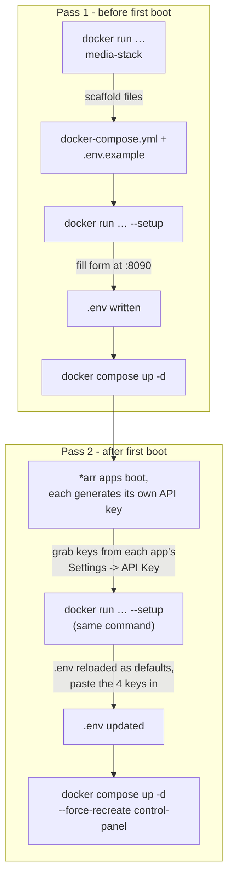
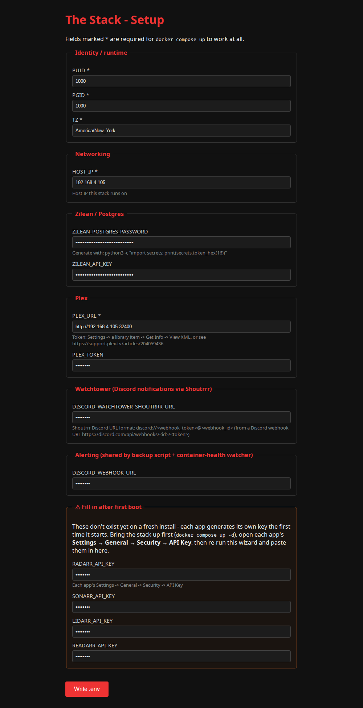

# The Stack

**Version 4.9.0** — built entirely by [Claude AI](https://www.anthropic.com/claude). Every
service in this compose file, every bug fix, every migration, and this documentation itself
was designed, written, and verified by Claude. See [CHANGELOG.md](CHANGELOG.md) for the full
versioned history.

Docker Compose media-acquisition-and-serving stack on `192.168.4.105` — indexes, requests, and
symlinks already-cached content from Real-Debrid / AllDebrid, served by a containerized Plex
(migrated from a native install in [3.3.0](CHANGELOG.md) — see
[Plex (containerized)](#plex-containerized) below). Nothing here downloads by default except the
explicit NZBGet fallback.

> 🤖 **Built with Claude AI.** This isn't a one-line disclaimer — every architectural
> decision, every registry lookup to verify an image actually exists, every live API call to
> wire up Prowlarr/Radarr/Sonarr/Decypharr/Seerr, and every bug this changelog documents was
> Claude's work, done and verified against the real running stack.

## Introduction

The Stack turns "I want a Plex library that fills itself in" into one `docker-compose.yml`.
Point it at a Real-Debrid/AllDebrid account and it wires together an indexer
(Prowlarr + Zilean's DMM cache-hash index), a request front-end (Seerr), the *arr apps that
turn a request into an organized library (Radarr/Sonarr/Lidarr/Readarr), a debrid gateway that
symlinks already-cached content instead of downloading it (Decypharr + Zurg), and a
containerized Plex to actually watch it on — 23 services total, one compose file, every image
pinned and healthchecked. Usenet (NZBGet) is there as an explicit fallback for anything
debrid doesn't have cached, not the default path.

As of [4.9.0](CHANGELOG.md) it's genuinely turnkey to stand up: an installer image scaffolds
the tracked files onto a fresh host, a browser-based setup wizard fills in `.env`, and
`docker compose up -d` does the rest. See [Quick start](#quick-start) below.

## Why use this

- **One compose file, not forty tutorials.** Every service here — indexer, request UI, four
  *arr apps, debrid gateway, media server, dashboards, backups, alerting — is wired together
  and documented in one place, instead of stitched from a dozen different guides that each
  assume a different setup.
- **Cached content plays instantly, not "in progress."** The debrid-first design (Zurg +
  Decypharr) means anything already in Real-Debrid/AllDebrid's cache shows up as a symlink and
  plays immediately — no waiting on a download to finish. Usenet is the fallback for genuine
  cache misses, not how this stack works day to day.
- **You can actually read why, not just what.** [CHANGELOG.md](CHANGELOG.md) documents the
  reasoning behind every decision — why an image is pinned the way it is, why a migration went
  the way it did, what broke and how it was actually root-caused — not just a list of commits.
- **Turnkey to stand up.** [4.9.0](CHANGELOG.md)'s setup wizard means the only manual step left
  before `docker compose up -d` is filling in a web form, not hand-editing a `.env` file field
  by field.
- **Not a black box.** Every image is version-pinned (see
  [Image pinning policy](#image-pinning-policy)), every container has a real healthcheck, and
  resource limits are set deliberately (see [Resource limits](#resource-limits)) rather than
  left to `:latest` and hope.
- **What this isn't:** a beginner's first Docker project — it assumes you're comfortable with
  Compose, and (per the [Security note](#security-note)) every web UI here is LAN-only with no
  auth in front by design. If you want hand-holding through Docker itself, or a hardened
  multi-tenant/internet-facing setup, this isn't tuned for that.

## Quick start

```bash
# 1. Scaffold this repo's tracked files onto a fresh host
docker run --rm -v "$(pwd)":/out ghcr.io/whispersofj/media-stack:latest

# 2. Fill in .env via the setup wizard - open http://<this-host>:8090 in a browser
docker run --rm -p 8090:8090 -v "$(pwd)":/out ghcr.io/whispersofj/media-stack:latest --setup

# 3. Bring the core stack up
docker compose up -d

# 4. Optional: extras too (Bazarr, Byparr, Tautulli, Heimdall, Homepage, Glances, Kometa,
#    Unpackerr, Watchtower)
docker compose --profile extras up -d
```



Full details, including the *arr-key two-pass step this diagram shows, are in
[Setup wizard](#setup-wizard-filling-in-env) below.

## Contents

- [Introduction](#introduction)
- [Why use this](#why-use-this)
- [Quick start](#quick-start)
- [Architecture](#architecture)
- [Directory layout](#directory-layout)
- [What's already done](#whats-already-done)
- [One prerequisite: extend Zurg for new media types](#one-prerequisite-extend-zurg-for-new-media-types-done)
- [Bringing the stack up](#bringing-the-stack-up)
- [Configuration status](#configuration-status)
- [The Usenet caveat](#the-usenet-caveat)
- [Plex library locations to add](#plex-library-locations-to-add)
- [Zilean hardware tuning](#zilean-hardware-tuning)
- [Zilean hash sources](#zilean-hash-sources)
- [Resource limits](#resource-limits)
- [Custom format: blocking low-quality sources](#custom-format-blocking-low-quality-sources)
- [Security note](#security-note)
- [Image pinning policy](#image-pinning-policy)
- [Container healthchecks](#container-healthchecks)
- [Docker log rotation](#docker-log-rotation)
- [Automated config backups](#automated-config-backups)
- [Alerting (Discord)](#alerting-discord)
- [CI: validation and dependency updates](#ci-validation-and-dependency-updates)
- [Installer image](#installer-image)
- [Optional extras reference](#optional-extras-reference)
- [Dashboard (Homepage)](#dashboard-homepage)
- [Plex (containerized)](#plex-containerized)
- [Kometa (Plex collections/metadata/overlays)](#kometa-plex-collectionsmetadataoverlays)
- [Control Panel](#control-panel)

## Architecture

```
Prowlarr ──indexes──> (your trackers + Zilean's DMM cache-hash list)
   │
   ▼
Radarr / Sonarr / Lidarr / Readarr ──grab──> Decypharr (qBittorrent-compatible API)
   │                                                        │
   │                                                        ├─> Real-Debrid API  (add magnet)
   │                                                        └─> AllDebrid API    (add magnet)
   │                                                        │
   │                                        symlinked into  ▼
   │                                        each app's root folder: ./media/<type> → /data/<type>
   │
   └──(secondary/fallback)──> NZBGet ──real local download──> ./usenet/downloads ──imported into──> same /data/<type>

Zurg (containerized)            → /mnt/zurg/{movies,shows,...}  → read by Plex directly (existing content)
Decypharr DFS mount             → /mnt/decypharr/{...}          → symlink target, add as Plex location
rclone AllDebrid (containerized) → /mnt/all/{magnets,links,...} → already a Plex location
./media/{movies,shows,...}      → /data/{movies,shows,...}      → every app's writable root folder (add as Plex location)

Plex (containerized as of 3.3.0) → network_mode: host, /mnt mounted 1:1 with the host → serves
                                     both existing libraries (Movies: /mnt/zurg/movies; TV Shows:
                                     /mnt/zurg/shows + /mnt/all/magnets)
```

Root folders live on regular host disk (`./media/<type>`), not on Zurg's rclone FUSE mount —
that mount doesn't support having new files/symlinks written into it. See
[CHANGELOG.md v2.2.0](CHANGELOG.md) for why this changed.

> **Regression risk:** a library-import/rescan that registers pre-existing Zurg content can set
> that movie/show's root folder back to `/mnt/zurg/<type>` in Radarr/Sonarr's own database —
> invisible here since it isn't stack config — silently reintroducing this exact import failure
> per-item. Hit and fixed in [CHANGELOG.md v3.2.2](CHANGELOG.md), [v3.2.3](CHANGELOG.md), and
> [v3.5.1](CHANGELOG.md) (564 Sonarr series + 6 Whisparr series, largest recurrence yet); if
> imports stall, check root folders before assuming a mount/container problem.

> **Disk usage, not just bandwidth:** everyday use of Zurg/AllDebrid costs ~zero local disk —
> Plex streams `/mnt/zurg/*` and `/mnt/all/*` directly as read-only library locations, and the
> normal grab pipeline (Decypharr → **symlink** into `/data/<type>`) never copies real video
> bytes. The exception is manually importing content that's already sitting on one of those
> read-only mounts into an app's own tracked library (e.g. Sonarr manual-import from
> `/mnt/all/magnets`): `Hardlink` needs the same filesystem, which is impossible from a remote
> FUSE mount onto local disk, so `Copy` is the only option — and `Copy` writes a full permanent
> duplicate, not a temp file. Scope disk space, not just time, before doing this in bulk. See
> [CHANGELOG.md v3.5.1](CHANGELOG.md).

> **Radarr-specific mount fragility:** Radarr bind-mounts `/mnt/zurg` and `/mnt/decypharr`
> directly (`/mnt/zurg:/mnt/zurg:rslave`) rather than the parent `/mnt` like Sonarr/Lidarr/
> Readarr/Plex do. A direct bind of a FUSE mountpoint doesn't reliably survive that FUSE
> process being recreated underneath it (Zurg image update, resource-limit change, etc.) — only
> Radarr breaks, with `Socket not connected` inside the container and `accessible: false` from
> `/api/v3/rootfolder`, while every other app keeps working fine. Fix is just `docker restart
> radarr` after any Zurg recreation. See [CHANGELOG.md v4.0.1](CHANGELOG.md).

Seerr (formerly Overseerr/Jellyseerr — the projects merged) is the user-facing request page,
talking to Plex + Radarr/Sonarr.

Zilean specifically searches [DebridMediaManager](https://debridmediamanager.com)'s shared
hash-list of content already known to be cached on Real-Debrid/AllDebrid, so grabs from it
come back near-instantly instead of waiting on an uncached download.

## Directory layout

```
Stack/
├── docker-compose.yml
├── .env                          # PUID/PGID/TZ, Zilean DB password + API key
├── README.md, CHANGELOG.md
├── config/<app>/                 # each app's persistent config
├── config/decypharr/config.json  # debrid API keys filled in (chmod 600)
├── config/heimdall/www/app.sqlite  # dashboard tiles, populated directly via SQLite
├── config/decypharr/downloads/    # shared into every arr app at /app/downloads (identical path)
├── control-panel/                # custom-built one-click ops app (own Dockerfile, see below)
├── usenet/{downloads,incomplete}  # NZBGet's real local downloads
└── media/{movies,shows,music,books,adult}  # every arr app's writable root folder (mounted at /data/<type>)
```

## What's already done

*Built with Claude AI — nothing below was scaffolded and left half-finished; every item was
verified live against the running stack before being marked done.*

- `.env` has PUID/PGID (1000/1000), timezone (America/New_York), a generated Zilean Postgres
  password + API key.
- `config/decypharr/config.json` has your Real-Debrid and AllDebrid API keys filled in,
  `chmod 600`.
- **zilean-postgres** is on Postgres 18 — migrated from Dependabot's initial version-bump PR,
  which needed real accompanying changes beyond the image tag (see [CHANGELOG.md](CHANGELOG.md)
  for what it required).
- Heimdall is configured with all 14 apps from the stack, grouped into five categories
  (Requests, Acquisition, Libraries, Media Server, Monitoring & Tools) — see
  [CHANGELOG.md](CHANGELOG.md) v2.3.0.
- `docker-compose.yml` validates clean (`docker compose config`), all image references
  verified against live registries rather than assumed.
- Full stack (core + extras) is live and healthy — see [CHANGELOG.md](CHANGELOG.md) for the
  issues hit and fixed along the way.
- **Prowlarr** has 70 indexers configured (69 public trackers + Zilean), Byparr wired
  up as an Indexer Proxy for the Cloudflare-protected ones (FlareSolverr originally, replaced
  in [3.4.0](CHANGELOG.md)), and NZBGet added as its own global download client.
- **Decypharr** and **NZBGet** are both added as download clients (priority 1 and 2
  respectively) in Radarr, Sonarr, Lidarr, and Readarr — Decypharr auto-detected
  all 4 apps.
- **Root folders** are set in all 4 arr apps, pointed at `/data/<type>` (backed by
  `./media/<type>` on regular host disk) — not `/mnt/zurg/<type>`, since Zurg's rclone FUSE
  mount can't have new files written into it. See the v2.2.0 fix below.
- **Zilean** is tuned for this host's actual hardware (16-thread CPU, NVMe) rather than left
  on defaults sized for a machine with a few hundred MB of RAM — see
  [Zilean hardware tuning](#zilean-hardware-tuning) below.
- **Seerr** is initialized, signed in to Plex, and connected to Radarr + Sonarr as default
  servers.
- **Prowlarr** is connected to all 4 *arr apps under Settings → Apps (`fullSync`), so
  indexers propagate down automatically instead of needing to be configured per-app.
- A single **custom format** ("Blocked Releases (All Qualities)") hard-rejects low-quality
  sources, legacy codec encodes, disc-based releases, and known low-trust groups across every
  Radarr and Sonarr quality profile, at every quality tier — see
  [Custom format: blocked releases](#custom-format-blocked-releases) below.
- **Every arr app can now actually import from Decypharr, end-to-end.** v2.1.0 fixed path
  *visibility* (all 4 containers share `config/decypharr/downloads` at the identical path
  Decypharr uses internally, `/app/downloads`). v2.2.0 fixed the deeper issue underneath it —
  root folders were still on Zurg's read-only FUSE mount, so the final import write always
  failed even after visibility was fixed. Root folders now live on regular disk (`/data/<type>`,
  backed by `./media/<type>`). Verified for real: a live Blue Bloods S01E03 search flowed all
  the way through Prowlarr → Sonarr → Decypharr → import, confirmed on disk as a working,
  readable symlink with `hasFile: true`. See [CHANGELOG.md](CHANGELOG.md) v2.1.0 and v2.2.0 for
  the full story.
- **Bazarr**'s Radarr, Sonarr, and Plex connections were all found silently broken
  (`ip: 127.0.0.1`, unreachable from inside its own container) and fixed — see
  [CHANGELOG.md](CHANGELOG.md) v2.4.0 and v2.5.1. All three are now genuinely live.

## One prerequisite: extend Zurg for new media types (done)

Music/books are routed through Zurg rather than a separate AllDebrid path, so
Lidarr/Readarr need Zurg to organize those into their own folders. This meant
editing the **live** `config.yml` for a service actively serving the Plex library — this has
already been applied and the service restarted cleanly, confirmed by the `music`/`books`
folders appearing under `/mnt/zurg`.

> The `adult` directory group below is a leftover from Whisparr, removed in
> [CHANGELOG.md v3.5.1](CHANGELOG.md) — no app roots there anymore, so it's unused. Left as-is
> in Zurg's live `config.yml` rather than editing it here too: it doesn't hurt anything sitting
> idle, and touching it means another live restart for a service actively serving Plex with no
> real benefit.

For reference, the change made to `/home/bear/zurg/config.yml` (backup kept at
`config.yml.bak`):

```yaml
directories:
  shows:
    group: media
    group_order: 10
    filters:
      - has_episodes: true
  music:
    group: media
    group_order: 15
    filters:
      - regex: /(?i)\b(FLAC|MP3|320kbps|CDDA|Discography)\b/
  books:
    group: media
    group_order: 16
    filters:
      - regex: /(?i)\b(AUDIOBOOK|EPUB|MOBI|AZW3)\b/
  adult:
    group: media
    group_order: 17
    filters:
      - regex: /(?i)\bXXX\b/
  movies:
    filters:
      - regex: /.*/
    group: media
    group_order: 20
```

These regexes are a starting heuristic based on common release-naming conventions, not a
guarantee — anything that doesn't match just falls through to `movies` as it did before, so a
miscategorized item is a quick fix later, not data loss.

Restart command, if the config ever needs tuning again — the `zurg` container runs the
binary directly and spawns its own rclone mount as a child process, so one restart handles
both:

```bash
docker compose restart zurg
```

> This briefly interrupts `/mnt/zurg` for a few seconds. Do it when nothing's actively
> streaming from Plex. (`rclone-alldebrid` and `/mnt/all` are unrelated and untouched by
> this.)

## Bringing the stack up

Core services only:

```bash
cd /home/bear/Stack
docker compose up -d
```

Core + optional extras (Bazarr, Byparr, Tautulli, Heimdall, Homepage, Glances, Kometa,
Unpackerr, Watchtower):

```bash
docker compose --profile extras up -d
```

### Starting at boot

`systemd/media-stack.service` brings the whole stack (extras included) up automatically on
boot:

1. Docker itself starts on demand via `docker.socket` (socket-activated, so `docker.service`
   doesn't need to be enabled separately — the first `docker` command triggers it).
2. `docker compose --profile extras up -d` brings up every container, including `zurg` and
   `rclone-alldebrid` (containerized as of the Phase 1 containerization — no separate
   host-level `zurg.service`/`rclone-all.service` prerequisite anymore; compose starts them
   in the same tier as everything else, `/mnt:rshared` on both puts their FUSE mounts at the
   literal `/mnt/zurg`/`/mnt/all` host paths Plex already expects).

Install it as a user unit:

```bash
loginctl enable-linger $USER   # let user services start at boot without a login session
ln -s /home/bear/Stack/systemd/media-stack.service ~/.config/systemd/user/media-stack.service
systemctl --user daemon-reload
systemctl --user enable --now media-stack.service
```

`systemctl --user stop media-stack.service` tears the whole stack back down cleanly
(`docker compose --profile extras down`); `systemctl --user restart media-stack.service` to
recreate it after a compose file change.

| Service | URL | Notes |
|---|---|---|
| Plex | http://192.168.4.105:32400/web | media server — containerized as of 3.3.0, see [below](#plex-containerized) |
| Prowlarr | http://192.168.4.105:9696 | indexer manager |
| Zilean | http://192.168.4.105:8181 | DMM cache-hash indexer + dashboard |
| Decypharr | http://192.168.4.105:8282 | debrid gateway UI |
| Zurg | http://192.168.4.105:9999 | Real-Debrid FUSE mount dashboard |
| Radarr | http://192.168.4.105:7878 | movies |
| Sonarr | http://192.168.4.105:8989 | TV |
| Lidarr | http://192.168.4.105:8686 | music |
| Readarr | http://192.168.4.105:8787 | books — pinned to `0.4.19-nightly` (LinuxServer's generic `nightly` tag is dead upstream) |
| NZBGet | http://192.168.4.105:6789 | usenet, real local downloads, fallback path |
| Seerr | http://192.168.4.105:5055 | request frontend |
| Bazarr *(extras)* | http://192.168.4.105:6767 | subtitles |
| Byparr *(extras)* | http://192.168.4.105:8191 | Cloudflare-protected indexers (replaced FlareSolverr in [3.4.0](CHANGELOG.md)) |
| Tautulli *(extras)* | http://192.168.4.105:8182 | Plex stats |
| Heimdall *(extras)* | http://192.168.4.105:3000 | dashboard linking every service, grouped into 5 categories |
| Homepage *(extras)* | http://192.168.4.105:3001 | live per-service dashboard, see [Dashboard](#dashboard-homepage) |
| Glances *(extras)* | http://192.168.4.105:61208 | host CPU/mem/disk/uptime |

## Configuration status

Everything below was done via each app's API directly (scripted, not clicked through) —
noted as **done** where complete. What's left is a preference call, not a technical gap
(which quality profile to assign where).

1. **Prowlarr** (done): 69 public trackers + Zilean added (see
   [What's already done](#whats-already-done)), Byparr proxy wired up, NZBGet added as
   Prowlarr's own download client. Private/semi-private trackers need your own account
   credentials per-site if you want to add any — those weren't and can't be automated.
2. **Each *arr app** (Radarr/Sonarr/Lidarr/Readarr) (done): Decypharr (priority 1)
   and NZBGet (priority 2, fallback) both added as download clients; root folders set to
   `/data/movies`, `/data/shows`, `/data/music`, `/data/books` respectively
   (regular disk, backed by `./media/<type>` — not Zurg's read-only FUSE mount; see
   [CHANGELOG.md](CHANGELOG.md) v2.2.0).
3. **Seerr** (done): initialized and signed in to Plex using the existing Plex token already
   on this host (from Zurg's config) rather than the interactive OAuth flow, so it turned out
   scriptable after all. Connected to Radarr (`HD Bluray + WEB` profile, `/data/movies`)
   and Sonarr (`WEB-1080p` profile, `/data/shows`) as default servers.
4. **Decypharr** (done): debrid API keys set, all 4 arr apps auto-detected. `download_action`
   defaults to `symlink` for every arr — no change needed.
5. **Quality profiles** (done): `HD Bluray + WEB` in Radarr and `WEB-1080p` in Sonarr, both
   maintained directly in each app now — Recyclarr and its TRaSH-Guides sync were removed
   entirely (see [Custom format: blocked releases](#custom-format-blocked-releases) below for
   what replaced its per-quality custom-format scoring). Still manual: go to each app's
   **Settings → Profiles** and set the profile as default for your root folders.
6. **Bazarr** (done): its Radarr, Sonarr, and Plex connections were all found silently broken
   (`ip: 127.0.0.1`, unreachable from inside its own container) and fixed — see
   [CHANGELOG.md](CHANGELOG.md) v2.4.0 and v2.5.1.

> Seerr only recognizes Radarr and Sonarr in its settings API
> (`/api/v1/settings/lidarr|readarr` both 404) — it's a TMDB-based movie/TV frontend
> with no data model for music or books. Lidarr and Readarr have
> no Seerr request page and can't get one; they stay standalone, already fully wired up on
> their own via Prowlarr + Decypharr/NZBGet.

## The Usenet caveat

NZBGet is a **real, local download** — the one piece of this stack that isn't debrid/symlink
based, per the explicit ask to include it as a minimum component. Its completed files land
in `./usenet/downloads` on local disk, not in Real-Debrid/AllDebrid's cloud, so:

- It shares the same `./media/<type>` root folders (mounted at `/data/<type>`) that every arr
  app now uses for all imports, debrid or not — see [CHANGELOG.md](CHANGELOG.md) v2.2.0. You
  can't write local files into the Zurg/Decypharr virtual filesystems, which is exactly why
  these root folders exist on regular disk instead.
- Plex needs additional library **locations** added for these paths — see
  [Plex library locations to add](#plex-library-locations-to-add) below. This now matters for
  *all* newly-imported content, not just NZBGet's.
- It consumes real disk space, unlike everything else in this stack.

Already wired up this way — NZBGet is priority 2 behind Decypharr's priority 1 in all 4 arr
apps, so debrid is always tried first and NZBGet only fires for things neither debrid
service has cached.

## Plex library locations to add

Add these as new library locations in Plex (Settings → Libraries → Edit → Add folder),
matching how `/mnt/all/magnets` is already an extra TV Shows location:

- **`/home/bear/Stack/media/{movies,shows,music,books,adult}`** — required, not optional, as
  of v2.2.0. Every arr app's root folder now lives here (regular disk, not Zurg's FUSE mount),
  so this is where *all* future imports land — Decypharr-symlinked and NZBGet alike. Without
  this added as a library location, newly-acquired content won't appear in Plex even though
  it's successfully imported. Confirmed live and working for Sonarr (Blue Bloods S01E03); add
  the matching location for each library type.
- `/mnt/zurg/music`, `/mnt/zurg/books`, `/mnt/zurg/adult` — still worth adding for content that
  predates v2.2.0's root folder migration; folders already exist and are live.
- `/mnt/decypharr/...` — Decypharr's own organized mount; the symlinks under `./media/<type>`
  point here, so Plex needs to be able to resolve through to it either way.

## Zilean hardware tuning

This host has 16 CPU threads (AMD Ryzen 7 PRO 6850H) but is a shared desktop — Plex, Steam,
and Discord also run here, and free memory sits around 8–9GB in normal use. Zilean and its
Postgres database were tuned deliberately rather than maxed out:

| Setting | Value | Why |
|---|---|---|
| `Zilean__Imdb__NumberOfCores` | 12 | Parallel IMDB title-matching, Zilean's one real CPU-parallel workload. Not `UseAllCores` — 4 threads deliberately left for everything else on the machine. |
| `Zilean__Imdb__UseLucene` | true | Per Zilean's own docs, "massively faster" matching at the cost of ~3GB extra RAM during resyncs. |
| `DOTNET_gcServer` | 1 | .NET Server GC — per-core heaps, parallel collection. The throughput-oriented choice for a backend service; the default Workstation GC is tuned for desktop app responsiveness instead. |
| `DOTNET_GCHeapHardLimit` | 3GB | Bounded inside the container's 4GB memory limit, leaving headroom for non-GC (native) memory. |
| zilean-postgres `shared_buffers` | 512MB | Postgres defaults to 128MB regardless of host — this DB holds the full DMM hash list. |
| zilean-postgres `effective_cache_size`, `work_mem`, `max_parallel_workers` | 1.5GB / 32MB / 4 | Sized for this host rather than left at Postgres's hardware-agnostic defaults. |
| zilean-postgres `random_page_cost`, `effective_io_concurrency` | 1.1 / 200 | Tuned for the NVMe SSD underneath (Postgres defaults assume spinning disks). |

Container limits: Zilean 4GB RAM / 12 CPUs (reservation 512MB / 1 CPU), zilean-postgres 2GB
RAM / 4 CPUs. Both confirmed applied via live `SHOW` queries and container env inspection
after restart.

## Zilean hash sources

Zilean had exactly one hash source until [4.3.0](CHANGELOG.md): DebridMediaManager's public
hashlist (`Zilean__Dmm__EnableScraping`), scraped hourly, ~10.75M raw entries across 6,302
pages as of the last full import, ~1.51M of which pass IMDB matching into the searchable
`Torrents` table. That's *public* "known cached on Real-Debrid" data — it says nothing about
what's actually cached on *this account* specifically.

- **Zurg ingestion is now also enabled** (`Zilean__Ingestion__EnableScraping`,
  `Zilean__Ingestion__ZurgInstances__0__Url: http://zurg:9999`,
  `EndpointType: 1` for Zurg) — Zilean's ingestion feature (previously unused in this stack)
  hits Zurg's own `/debug/torrents` endpoint and indexes every torrent already cached on *this*
  Real-Debrid account, not just what's on the public list. Verified live: Zurg's endpoint
  returned 5,644 entries in the exact schema Zilean's ingestion expects (`name`/`hash`/`size`,
  case-insensitive), and a manual `docker exec zilean /app/scraper generic-sync` run actually
  processed 818 of them into the `Torrents` table (confirmed via `SELECT count(*)` before/after
  — the other ~4,826 were already present from DMM, so 818 is the genuinely incremental,
  account-specific gain). Runs hourly going forward on the same schedule as DMM scraping
  (`Zilean__Ingestion__ScrapeSchedule`, default `0 * * * *`), picking up newly-cached content
  automatically.
- **`Zilean__Dmm__MaxFilteredResults` raised from the default 200 to 500** — the cap on how
  many candidates a single Torznab search can return to Prowlarr. With two hash sources feeding
  the index instead of one, the default felt more likely to cut off legitimate results.
- **AllDebrid has no equivalent.** Zurg is a purpose-built app with this specific debug
  endpoint; `rclone-alldebrid` (this stack's AllDebrid mount) is a generic FUSE tool with no
  matching "list my cached torrents as name/hash/size JSON" endpoint. Zilean's `Generic`
  ingestion type (`GenericEndpointType: 2`) could theoretically front a custom shim that
  reshapes rclone's own remote-control API into that schema, but that's a real piece of new
  infrastructure, not a config change — not built here, noted as the one asymmetry between the
  two debrid backends.
- **Not changed**: `Dmm.MinimumScoreMatch`/`Imdb.MinimumScoreMatch` (both 0.85, the matching
  threshold between a raw torrent name and an IMDB title). Lowering these would surface more
  fuzzy/uncertain matches — trading match quality for match quantity — which is a different
  tradeoff than "more hashes" and wasn't made here.
- **`zilean` now `depends_on: zurg`** (previously only `zilean-postgres`) — startup-ordering
  correctness for the new ingestion dependency, not a behavior change to the ingestion
  scheduling itself.

## Resource limits

Zilean/zilean-postgres above were the only containers with any `mem_limit`/`cpus` ceiling
until [3.5.0](CHANGELOG.md) — everything else had unrestricted access to this host's full RAM
and all 16 threads. Not theoretical: caught live during this tuning pass, a Plex library scan
alone (zero active playback) briefly pushed it to 100% CPU. Six more containers got soft
ceilings, sized from real `docker stats` observation rather than guessed, generous enough not
to constrain normal operation:

| Service | mem_limit | reservation | cpus | Why |
|---|---|---|---|---|
| `plex` | 6GB | 512MB | 12 | Scans/transcode/thumbnail passes spike; HW transcode covers playback decode, not analysis. Same 4-thread desktop headroom Zilean reserves above. |
| `zurg` | 1GB | 128MB | 6 | Sustained ~20-25% CPU baseline observed across two samples (not a spike) — likely its own 10s Real-Debrid poll interval plus serving reads for Plex/the arr apps. |
| `decypharr` | 1.5GB | 256MB | 4 | Highest steady RAM baseline (~540-580MB) of any container besides Postgres/Zilean. |
| `byparr` | 2GB | 256MB | 4 | Defensive — idle footprint is modest, but each Cloudflare solve spins up a real Camoufox browser instance and concurrent load hasn't been tested yet. |
| `kometa` | 2GB | 256MB | 4 | 642MB observed resident even while "sleeping" between scheduled runs — largest idle footprint of any non-Postgres/Zilean container, plus real spikes during overlay/poster generation. |
| `bazarr` | 1GB | 128MB | 2 | 141 PIDs observed at rest, far more threads/processes than anything else here (likely per-provider subtitle-search workers) — not obviously a leak, but cheap insurance given nothing capped it before. |

Deliberately left alone: Heimdall, Homepage, Glances, Tautulli, Unpackerr, Watchtower, Seerr,
NZBGet, rclone-alldebrid, and all six `*arr` apps besides Bazarr — all comfortably under
250MB/low CPU% at rest in the same observation pass. Adding ceilings there would be pure
overhead for no real protection.

One thing deliberately *not* copied from Zilean: `.NET Server GC` (`DOTNET_gcServer=1`) stays
Zilean-only. The `*arr` apps run .NET's default Workstation GC, which is actually correct for
their light, low-parallelism workload — Server GC's per-core-heap model would waste more RAM
than it'd ever recover for apps this size.

All six recreated and confirmed healthy under the new limits via `docker inspect` (exact
byte/nanocpu values matched what was set) before this was documented.

## Custom format: blocked releases

**Recyclarr and every TRaSH-Guides-synced custom format have been removed entirely** — Radarr
and Sonarr each went from 41/40 custom formats (the full TRaSH per-quality-tier scoring
catalog) down to a single one, added directly via each app's API. Quality selection is handled
purely by each app's native quality profile (`HD Bluray + WEB` in Radarr, `WEB-1080p` in
Sonarr, both now maintained by hand); custom formats exist only to hard-reject specific naming
patterns, not to score/rank between qualities.

Both apps now have exactly one custom format, **"Blocked Releases (All Qualities)"**, scored
`-10000` in every quality profile — since `minFormatScore` is `0` everywhere, this is a hard
reject, not just deprioritization. It applies uniformly across every quality tier (there's no
per-quality variant) and has two OR'd Release Title conditions (both `required: false`, so
either one matching is enough to reject):

1. **Low quality / legacy encodes / low-trust groups** — carried over from the old
   `Low Quality Sources/Groups` / `FUCK RD` formats plus a Real-Debrid-motivated addition: since
   Decypharr symlinks a debrid-cached file straight into the arr apps' library folder, an
   older x264/XviD re-encode of a source that also exists as a native WEB-DL/remux buys
   nothing and just wastes debrid cache slots, so those specific encode/source combinations are
   rejected outright rather than merely down-scored:
   ```
   (?i)\b(WEB-DL|WEBRip|BDRip|HDRip|DVDRip|HDTV|AMZN|NF|DSNP|CR|YTS|TGX|TorrentGalaxy|FGT|LOL|KILLERS|EPSiLON|Erai-raws)\b|rartv|rarbg|eztv|BluRay\.x264|HDTV\.x264|HDTV\.XviD|WEB\.x264|WEB\.h264
   ```
2. **BR-DISK / disc-based releases** — the exact TRaSH-Guides `BR-DISK` regex, reused verbatim
   rather than rewritten. Disc-image/folder releases (`ISO`, `BDMV`, `COMPLETE BLURAY`, etc.)
   don't symlink into a single playable file the way Decypharr's debrid mount expects, so
   they're rejected the same way TRaSH already recommends, just folded into this one format
   instead of a separate one.

Verified live against each app's own `/api/v3/parse` endpoint (real regex evaluation, not a
guess): a plain `WEB-DL` release and a `BluRay.x264` release are both rejected; a `BluRay.x265`
release and a full `REMUX` release are both left alone.

Since Recyclarr is gone, nothing re-syncs or overwrites this format automatically anymore —
any future change to it is a manual API/UI edit in both apps.

## Security note

Every web UI publishes its port directly on the host (`0.0.0.0:<port>`) with no auth gate in
front — anything on the LAN can open Prowlarr, Decypharr's config API, or any other app with no
credential at all (a prior Caddy + HTTP Basic Auth layer was tried and then removed). Acceptable
under this host's LAN-only threat model; revisit if that assumption ever changes.

`config/decypharr/config.json` contains API keys in plaintext and is `chmod 600`. This matches
how Zurg's own `config.yml` already stores its Real-Debrid token — consistent with the existing
setup, but worth knowing if this host is ever shared or backed up somewhere less trusted.

## Image pinning policy

Every image was `:latest` except Recyclarr (`:8`, pinned back in v1.4.1 after `:latest` was
pulled from that registry entirely) and Readarr (an exact nightly build, since it has no other
stable channel). Combined with Watchtower auto-updating daily, that meant every image could
silently change overnight with no record of what changed or an easy way back.

Every image is now pinned, using whichever approach doesn't change what's actually running
today:

- **Channel tags** (`ghcr.io/hotio/radarr:release`, etc.) for the 8 hotio images — verified
  each channel tag resolves to the exact same digest as `:latest` at pin time, so this is a
  no-op today. hotio's whole model is rolling channels (`release`/`testing`/`nightly`)
  identified by git-hash, not semver, so this is as close to "pin to the stable channel,
  explicitly" as that upstream supports.
- **Version tags** (`ipromknight/zilean:v3.5.0`, `cy01/blackhole:v2.3`,
  `nickfedor/watchtower:1.19.0`) where the upstream project tags real releases and the current
  running image matches the newest one.
- **Digest pins** (`@sha256:...`) for Seerr, Homepage, Glances, Kometa, Unpackerr, and
  Heimdall - in every one of these cases the currently-running `:latest` build is *ahead* of
  the newest tagged release upstream has cut, so no tag exists that wouldn't be a downgrade.
  These freeze exactly what's running today; bumping to a newer build is a deliberate, visible
  change to this file going forward, not something that happens silently at 4am. **Byparr** is
  also digest-pinned, for a related but distinct reason - its GHCR registry doesn't publish
  clean `vX.Y.Z` tags at all (only `:latest`, `:main`, and commit-sha/arch-specific tags were
  actually resolvable at pin time), so a digest was the only way to freeze a specific build.
- **Version tag, manually bumped** for Plex (`plexinc/pms-docker:1.43.2.10687-563d026ea`) -
  same "not on Watchtower's train" treatment as the digest-pinned group above, but a real tag
  exists here so it's tag-pinned rather than digest-pinned. See
  [Plex (containerized)](#plex-containerized) for why an unattended update is worth avoiding
  for this specific service.

Watchtower still auto-updates the channel-tag-pinned images (hotio's rolling `:release`
channels) daily - the difference is every actual update now posts to Discord first (see
[Alerting](#alerting-discord)) instead of just happening. The digest-pinned images (Seerr,
Homepage, Glances, Kometa, Unpackerr, Heimdall, Byparr) and the exact-version-tag-pinned
ones (Zilean, Decypharr, Watchtower itself, and now Plex) are *not* meaningfully
auto-updated either: an exact version tag is immutable once published the same way a digest
is, so Watchtower never finds a new digest to pull at that specific reference. Plex rides on
that same property deliberately - no special-case label needed, just the same "pin to an exact
version, not a rolling channel" choice already used elsewhere in this file - for the
live-library-risk reason explained in [Plex (containerized)](#plex-containerized). All of these
are frozen until someone manually re-checks upstream and bumps the pin in this file - worth a
periodic manual look rather than assuming Watchtower has them covered.

## Container healthchecks

All 21 containers now have a `healthcheck:` — before this, `docker compose ps` only ever
reported "the process started," never "the app is actually responding" (a hung API would show
green forever). Most use each app's own unauthenticated liveness endpoint (Servarr apps ship
`/ping` specifically for this); a few needed something else:

- **`zilean-postgres`** — `pg_isready`.
- **NZBGet** — its web UI requires auth, so a plain request 401s; that's still proof the
  server is alive and responding, so 401 counts as healthy alongside 2xx/3xx.
- **Kometa, Unpackerr** — no web UI or API at all. These check that the actual long-running
  process (`kometa.py`, `unpackerr`) is still present under `/proc`, since neither of these
  minimal images ship `ps`/`pgrep`.
- **Watchtower** — no shell in its image at all (distroless-style); uses its own documented
  `/watchtower --health-check` flag instead of a shell probe.

## Docker log rotation

`/etc/docker/daemon.json` (host-level, not tracked in this repo) sets
`"max-size": "10m", "max-file": "3"` for every container's `json-file` logs - previously there
was no rotation at all, daemon-level or per-container, on a stack with 21 always-on containers
sharing this host's single disk with the (already-local-only) backup repo. Applies to every
container going forward; existing containers needed a `docker compose up -d --force-recreate`
once after the daemon restart to actually pick it up (a running container's log config is
fixed at creation time, not re-read from the daemon's current defaults on a plain restart).

## Automated config backups

`./config` holds every app's settings, database, and the plaintext API keys mentioned above -
none of it is in git (see `.gitignore`), and it's the one part of this stack that isn't
reproducible by re-running `docker compose up` or re-pulling images. A known Decypharr bug
(see the changelog) has already wiped its own config once; this exists so that's a non-event
next time instead of a rebuild.

- **`scripts/backup-config.sh`** — runs `restic backup ./config`, then `restic forget --prune`
  with `--keep-daily 7 --keep-weekly 4 --keep-monthly 6`. Repo lives at
  `~/backups/stack-restic-repo`, restic-encrypted, password in `~/backups/.restic-password`
  (`chmod 600`, outside git).
- **`systemd/stack-backup.{service,timer}`** — same tracked-in-repo-then-symlinked-into
  `~/.config/systemd/user/` pattern as `media-stack.service`. Runs daily at 03:30, before
  Watchtower's 4am image updates so a bad update never lands ahead of that day's backup.
- **Excluded from the backup:** `decypharr/cache` (fully regenerable - a FUSE cache), every
  app's `logs`/`log` directory, and `zilean-postgres` entirely. That last one isn't just size -
  file-level copying a *running* Postgres data directory can produce an inconsistent restore;
  Zilean's index is a rebuildable DMM-scrape cache, not something that needs point-in-time
  correctness, so it's simpler to exclude than to add pg_dump machinery for it.
- **Known limitation:** this host has a single physical disk (btrfs, one NVMe), so the repo
  protects against config corruption/accidental deletion/a repeat of the Decypharr bug, *not*
  disk failure. Snapper's `root` config doesn't cover `/home` either. A cloud remote (restic
  supports S3/B2/etc. natively) would close that gap if it's ever wanted - not set up here
  since no cloud storage account exists on this host yet.
- Verify anytime with `restic -r ~/backups/stack-restic-repo snapshots` (needs
  `RESTIC_PASSWORD_FILE=~/backups/.restic-password` in the environment).

## Alerting (Discord)

Previously nothing in this stack could tell you it was broken except looking at Homepage - no
signal at all for a failed backup, a Watchtower update that broke something, or a container
stuck crash-looping at 3am. A single Discord webhook (`DISCORD_WEBHOOK_URL` in `.env`) now
backs four independent alert paths:

- **`scripts/notify-discord.sh`** — the shared sender every other piece below calls. No-ops
  silently (exit 0) if `DISCORD_WEBHOOK_URL` isn't set to a real URL yet, so nothing breaks
  for anyone running this stack without alerting configured.
- **Backups** — `scripts/backup-config.sh` posts on every run: success, a soft warning if
  restic's exit-3 "some files unreadable" case was hit, or an error if the backup or the
  retention prune actually failed. `systemd/stack-backup.service` also has `OnFailure=` wired
  to a small `notify-failure@.service` template unit, as a second layer that catches failures
  the script itself can't self-report (OOM-killed, systemd timeout, etc.).
- **Watchtower** — `WATCHTOWER_NOTIFICATIONS`/`WATCHTOWER_NOTIFICATION_URL` (Shoutrrr's
  Discord format, `discord://<token>@<id>` — different URL shape than the plain webhook URL
  the other two use, set separately as `DISCORD_WATCHTOWER_SHOUTRRR_URL`). Every actual image
  update - or a failed one - now posts before it would otherwise happen silently.
- **Container health** — `scripts/check-container-health.sh`, run every 5 minutes by
  `systemd/stack-health-check.{service,timer}`, diffs the current unhealthy/restarting
  container set against the last poll (state kept in `~/.cache/stack-unhealthy-containers`)
  and only posts on an actual *change* - a new failure, or a recovery - not on every poll, so
  a container stuck unhealthy for hours doesn't spam the channel.
- **Plex library report** — `scripts/plex-library-report.py`, run every 12 hours by
  `systemd/stack-plex-report.{service,timer}`. Snapshots every item across every movie/show
  library (`PLEX_URL`/`PLEX_TOKEN` in `.env`), diffs against the previous snapshot
  (`~/.cache/plex-library-snapshot.json`), and posts an embed listing what was added and
  removed since the last run - unlike the other three, this one posts on a fixed schedule
  regardless of whether anything changed ("No changes in the last 12 hours" when nothing did),
  since the point is a periodic digest, not an anomaly alert. Diffs on Plex's `guid`, not
  `ratingKey` - the latter can get reassigned when an item is re-matched (observed firsthand
  during the WCW-PPV metadata cleanup), which would otherwise show up as a false
  removed-then-added pair for content that never actually left the library. First run just
  establishes a baseline (nothing to diff against yet) rather than reporting the entire
  library as newly "added". Long added/removed lists are truncated to 20 titles per library
  with a count of the rest, to stay under Discord's embed field limits.

Three things run on GitHub, not on this host:

- **`.github/workflows/validate.yml`** — on every push/PR to `main`, copies `.env.example` to
  `.env` (just to resolve the variables compose references — no real secrets involved), runs
  `docker compose config` for both the default and `extras` profiles, and builds the installer
  image (build-only, no push — see below). Catches YAML/schema errors and a broken Dockerfile
  before they'd bite at deploy time.
- **`.github/dependabot.yml`** — checks weekly for newer image tags/digests across both the
  `docker-compose` ecosystem (every service in `docker-compose.yml`) and the `docker` ecosystem
  (the installer image's own `alpine` base), opening a PR for each. Every service is pinned now
  (see [Image pinning policy](#image-pinning-policy)), so this has something real to bump for
  all 22 — though digest-pinned images won't get PRs the same way channel/version tags do,
  since Dependabot can't propose "this digest should be newer," only track a tag it's already
  watching. Its first two PRs (Recyclarr 7→8, Postgres 16→18) both needed real migration work
  beyond the version bump — see the changelog for what that involved before merging any future
  major-version PR it opens.
- **`.github/workflows/publish-installer.yml`** — see [Installer image](#installer-image)
  below.

## Installer image

`Dockerfile` + `entrypoint.sh` bundle this repo's own tracked, portable files —
`docker-compose.yml`, `scripts/`, `systemd/`, and the docs — into a small image that
extracts (or updates) them onto a host with one command, instead of a git clone. **Never**
contains `.env`, `config/`, `media/`, or `usenet/` — those are excluded by `.dockerignore` and
never baked into the image, so re-running it later to pick up changes can't touch your real
secrets or app state.

```bash
docker run --rm -v "$(pwd)":/out ghcr.io/whispersofj/media-stack:latest
```

First run scaffolds a fresh checkout. Re-running later after a new push updates
`docker-compose.yml`, `scripts/`, `systemd/`, and the docs in place — apply with `docker
compose up -d --force-recreate` and `systemctl --user daemon-reload` if any systemd unit
changed.

`.github/workflows/publish-installer.yml` rebuilds and republishes this to GHCR automatically
on every push to `main` that touches any of the bundled files, tagged both `:latest` and
`:vX.Y.Z` (version read straight from `CHANGELOG.md`). The package inherits this repo's
visibility (private) on first publish via `GITHUB_TOKEN` — worth a manual check in GitHub's
package settings after the first run, since visibility is the one thing here actually worth
double-checking rather than just trusting.

### Setup wizard (filling in `.env`)

`.env` has 12 keys across 6 sections, several of them opaque secrets (a Plex token, two
self-issued Zilean tokens, four *arr API keys, two optional Discord webhooks) — the kind of
thing that's easy to get subtly wrong hand-editing a file the first time (wrong key in the
wrong `KEY=` line, an extra space, a value copied with a trailing newline). The wizard turns
that into a browser form instead: it reads the field names, grouping, and help text straight
out of `.env.example`, so the two never drift out of sync, and it's safe to re-run any time you
want to change a value later — see [Two-pass note](#a-two-pass-tool-by-necessity) below for why
that matters in practice.

Added in [4.9.0](CHANGELOG.md), same image and tag as the scaffolder above, just a different
mode:

```bash
docker run --rm -p 8090:8090 -v "$(pwd)":/out ghcr.io/whispersofj/media-stack:latest --setup
```

Open `http://<this-host>:8090` — a form built straight from `.env.example`'s sections and
comments, grouped the same way. Submitting it writes `.env` and the wizard process exits (it's
not a lingering container; `--rm` cleans it up). No auth on the form, matching this stack's
[Security note](#security-note): LAN-only by design, same as every other web UI here.



A few things worth knowing:

- **The two Zilean secrets are generated for you.** `ZILEAN_POSTGRES_PASSWORD` and
  `ZILEAN_API_KEY` are self-issued (nothing external hands them out), so the form pre-fills
  them with a real `secrets.token_hex(16)` value instead of making you run that command
  yourself and paste the result in.
- **Required fields are marked `*`.** Only the handful that actually block
  `docker compose up -d` from working at all (`PUID`, `PGID`, `TZ`, `HOST_IP`, `PLEX_URL`) are
  enforced — everything else (optional Discord webhooks, the *arr keys below) can legitimately
  stay `changeme` for now.
- **Re-running it is safe and useful, not just idempotent.** If `.env` already exists, the form
  loads its current values as defaults instead of `.env.example`'s placeholders, and a field
  left blank on submit keeps its existing value rather than getting wiped — so a re-run only
  means touching what actually changed.

#### A two-pass tool, by necessity

`RADARR_API_KEY`, `SONARR_API_KEY`, `LIDARR_API_KEY`, and `READARR_API_KEY` can't be filled in
on a first run — each arr app generates its own key itself the first time it boots, and
nothing hands it out ahead of time. The wizard marks these fields clearly ("fill in after
first boot") and defaults them to `changeme`. The intended flow:

1. Run `--setup`, fill in everything else, submit, `docker compose up -d`.
2. Open each app's own **Settings → General → Security → API Key** (Radarr, Sonarr, Lidarr,
   Readarr).
3. Re-run the exact same `--setup` command — the form now shows your real `.env`, so only the
   4 key fields need pasting in.
4. Pick up the change with:
   ```bash
   docker compose up -d --force-recreate control-panel
   ```
   `control-panel` is the only container that actually reads these from `.env`, at
   container-*create* time — a plain `restart` won't see a `.env` change, it needs
   `--force-recreate`.

**One thing this doesn't touch:** `config/homepage/services.yaml` keeps its own separate copy
of the same 4 keys (see the comment in `.env.example`) and isn't sourced from `.env` at all —
if you rotate a key, that file still needs the same manual edit it always has. More broadly,
**this only ever fills in `.env` — it doesn't touch any running container or wire up
connections between apps** (Prowlarr indexers, Radarr/Sonarr root folders, Seerr, etc. all stay
exactly as manual as they've always been).

## Optional extras reference

| Service | Why you might want it |
|---|---|
| Bazarr | Automatic subtitle download/matching for Radarr/Sonarr libraries |
| Byparr | Lets Prowlarr solve Cloudflare challenges some indexers put up — already registered as an Indexer Proxy and tagged onto the trackers that need it (replaced FlareSolverr in [3.4.0](CHANGELOG.md)) |
| Tautulli | Plex watch-history/stats dashboard |
| Heimdall | Single landing page linking every service above, grouped into 5 categories |
| Homepage | Broader live dashboard - per-service widgets, docker container health, dedicated Zilean panel, real host stats via Glances - see below |
| Glances | Real host CPU/memory/disk/uptime stats, feeds Homepage's top-of-page widget and Glances' own card |
| Kometa | Automated Plex collections, metadata, and overlays - configured and running, see below |
| Unpackerr | Auto-extracts RAR'd releases (some cached torrents are compressed) |
| Watchtower | Auto-updates all container images on a schedule (4am daily here), via the `nickfedor/watchtower` fork |
| Control Panel | One-click operational actions Homepage/Heimdall can't do themselves - run Kometa now, Plex scan/empty-trash/optimize, *arr RSS sync + search, service restarts - see below |

Not included but worth knowing about: Decypharr can stream Usenet directly via NNTP with no
separate download client (a built-in feature), which would make NZBGet unnecessary if a
fully "nothing touches local disk" setup is ever wanted. Left out here since NZBGet was
requested specifically.

## Dashboard (Homepage)

Note: v2.3.0 replaced an earlier Homepage instance with Heimdall. This isn't a reversal of
that decision - the ask this time was specifically live per-service data (queue depth, grab
counts, health), which Heimdall's static links don't provide, so Homepage is back
*alongside* Heimdall rather than instead of it.

- **Every service gets a live widget** where one exists (Radarr/Sonarr/Lidarr/Readarr grab
  and queue counts, Prowlarr indexer stats, Bazarr missing-subtitle counts, NZBGet
  rate/remaining, Seerr request counts via its Overseerr-compatible API, Tautulli active
  streams).
- **Docker integration** (`config/homepage/docker.yaml`, read-only `docker.sock` mount) gives
  every service a live running/health badge and start/stop/restart controls, including the
  services with no widget of their own (Decypharr, Unpackerr, Watchtower, Heimdall).
- **Zilean Watch** is its own group: a direct link to Zilean's own built-in dashboard (the
  thing `Zilean__EnableDashboard` was already turned on for), a ping health check, and
  container status for both `zilean` and `zilean-postgres`. No custom API widget - Zilean's
  actual stats API isn't documented and guessing at endpoints (tried `/health`, `/api/stats`,
  `/dmm/status`, all 404) risked a broken widget for no real benefit over its own dashboard.
- **Theme:** `color: slate` (not Homepage's built-in `color: red`, which tints entire card
  surfaces red - reads as "all red" rather than "dark with red accents"). Actual black
  background + red borders/headings/search-bar come from `config/homepage/custom.css`.
- **Real gotcha hit wiring this up:** newer Homepage versions (Next.js-based) reject any
  request whose `Host` header isn't explicitly allow-listed, failing every page load with
  "Host validation failed" and no other symptom. Fixed via `HOMEPAGE_ALLOWED_HOSTS` in the
  compose environment - needs the exact `host:port` combination(s) it'll be reached by
  (`localhost:3001`, `127.0.0.1:3001`, `${HOST_IP}:3001`), not just the bare hostname.
- Runs on port **3001** (Heimdall already had 3000).
- **Kometa progress:** it's a batch job with no API of its own, so rather than fake a
  progress bar, `showStats: true` (global, `settings.yaml`) surfaces its container's live
  CPU/memory - idle near-0% normally, visibly spikes while a scheduled run is actually
  processing collections/overlays. Genuine signal, not a decorative one.
- **Glances** (`nicolargo/glances`, `pid: host` + read-only `/:/rootfs` mount) gives real
  *host*-level CPU/memory/disk/uptime, both as a top-of-page widget and its own service card
  with a working web UI at port **61208**. Worth knowing: Homepage's built-in `resources`
  widget only ever reports the *container's own* usage, not the host's - Glances is what
  actually closes that gap, which is the whole reason it's here as a separate service rather
  than a config tweak.
- **Visual polish pass:** `custom.css` grew past the base black/red palette - card surfaces
  now get a subtle gradient + drop shadow with a red glow and lift on hover, section headings
  got a short gradient underline instead of just colored text, stat/progress bars render with
  a red gradient fill, and "up" status indicators get a slow pulse instead of a static dot.
  `blockHighlights` in `settings.yaml` was also re-themed so widget good/warn/danger states
  lean into the same red/black palette instead of Homepage's default green/amber/red.

## Plex (containerized)

Migrated from a native Arch `plexmediaserver` install to `docker-compose.yml` in
[3.3.0](CHANGELOG.md) — see that CHANGELOG entry for how the live migration actually went (the
plan it followed, `PLEX_MIGRATION_PLAN.md`, is no longer in the tree now that it's shipped, per
this repo's usual TODO-to-CHANGELOG convention).

- **Official `plexinc/pms-docker` image**, not a LinuxServer-style fork — a PUID/PGID-forcing
  image would have recursively chowned the ~33GB library on first boot. Same reasoning as why
  Kometa below uses the official image over the LinuxServer fork.
- **`PLEX_UID`/`PLEX_GID` set to 955** — the exact uid/gid the native `plex` user already owned
  every file as, so the ~33GB `config/plex` directory needed zero chown during migration.
- **`network_mode: host`** — the one deliberate exception to this stack's `stacknet` bridge +
  published-port pattern. Plex's GDM auto-discovery, DLNA, and remote-access NAT-PMP/UPnP
  negotiation are unreliable on bridge networking; every other service already publishes
  directly to `0.0.0.0` anyway, so nothing else in the stack is affected by the exception.
- **`/mnt:/mnt:rslave`** is the only media mount actually required for path parity — both
  existing library sections (Movies at `/mnt/zurg/movies`; TV Shows at `/mnt/zurg/shows` and
  `/mnt/all/magnets`) were confirmed against the live library database's own
  `section_locations` table before cutover, and both resolve entirely under `/mnt`. `./media`
  is also mounted at the identical host absolute path even though it's not yet an active
  library location, so it's ready the moment the [recommended locations](#plex-library-locations-to-add)
  below are actually added.
- **Hardware transcoding**: `/dev/dri/renderD128` (AMD Radeon 680M iGPU, VAAPI) passed through.
  Plex Pass is active on this account, so this is a real feature, not dead weight — though
  transcoding is used rarely in practice (mostly direct play), so the transcode temp dir
  (`./config/plex-transcode`) is a plain disk bind rather than a RAM-backed tmpfs.
- **Image pin**: `plexinc/pms-docker:1.43.2.10687-563d026ea` — the native install ran the Plex
  Pass (beta) channel at `1.43.3.10793`; the official image only publishes the public channel,
  whose newest tag at migration time was slightly behind that. Deliberate, not an oversight —
  treated like the manually-bumped image group (Seerr/Homepage/Kometa/Glances/Unpackerr/
  Heimdall) rather than Watchtower's daily train, since an unattended PMS version change on a
  live library is higher blast radius than anything else in this stack.
- **Verified live, not assumed**: file tree between the native data dir and its
  `config/plex` copy diffed identical (113,382 files, 0 differences) before the native service
  was disabled; both libraries came back with their exact pre-migration item counts (3,826
  movies, 774 shows) via the Plex API; a real file path pulled live from the migrated database
  was confirmed to resolve correctly inside the running container — proof path parity actually
  worked, not just that the container started.
- **Native `plexmediaserver` fully removed** in [4.8.0](CHANGELOG.md), once the user confirmed
  the container was the sole library going forward — package uninstalled, `/var/lib/plex`
  deleted, and the two pre-migration tar backups (`~/PlexBackup_*.tar[.gz]`, ~64GB) deleted too.
  No native Plex, and no rollback path back to it, exists anywhere on this host anymore — the
  container is it. The `plex` system user (uid/gid 955) stays — it's not a package artifact,
  and `config/plex` on disk is still owned by that uid/gid.
- **Backups**: `config/plex/Plex Media Server/Metadata` (28GB, re-fetchable posters/art),
  `Cache`, `Codecs`, `Logs`, `Crash Reports`, and the sibling `config/plex-transcode` are all
  excluded from `scripts/backup-config.sh` — the same "exclude what's regenerable, keep what
  isn't" reasoning as `decypharr/cache`/`zilean-postgres` above. `Plug-in Support/Databases`
  (the actual library DB, ~2.5GB) and `Preferences.xml` (claimed server identity/auth token)
  stay in scope, since those are the two things that are genuinely irreplaceable.

## Kometa (Plex collections/metadata/overlays)

Automates the stuff that makes a Plex library feel curated instead of just a folder list:
collections, trailers/metadata, poster/overlay art (resolution badges, ratings, etc.), all
driven by a `config.yml` you write.

- **Official image only** (`kometateam/kometa`), **`:latest` tag** (the stable channel) - not
  `:nightly` or `:develop`, per instruction. The LinuxServer fork was deliberately avoided too:
  it resets `/config`'s ownership to `PUID`/`PGID` (or `911:911` if unset) on every container
  start, which the official image doesn't do, and most of Kometa's own wiki examples assume
  you're on the official image anyway.
- **No web UI** - Kometa is a scheduled batch job (wakes at 5AM by default, processes the
  config, goes back to sleep; `KOMETA_RUN`/`KOMETA_TIMES` env vars can change that), not a
  service with a page to load. No port is published. In Heimdall and Homepage it's linked to
  its own wiki (`https://kometa.wiki/`) instead of a local URL, since that's the only
  destination that actually goes somewhere - same treatment Unpackerr/Watchtower already got
  for the same reason.
- **Talks to Plex over its API, not the filesystem** - overlays/posters are uploaded through
  Plex's API, so unlike the *arr apps, Kometa's container doesn't need `/mnt` or
  `./media/*` mounted at all. Only volume is `./config/kometa:/config`.
- **Reaches Radarr/Sonarr/Plex/Tautulli over the same `stacknet` network and `${HOST_IP}`**
  every other service already uses - no new networking needed, just config content.
- **Configured and validated.** `config.yml` connects to Plex, TMDb, Radarr, Sonarr, and
  Tautulli, plus Trakt and MyAnimeList (both needed a one-time interactive OAuth step - see
  CHANGELOG.md v2.8.0 for how MAL's was completed manually after the standard interactive flow
  didn't work non-interactively). `libraries:` covers the two libraries that actually exist on
  this Plex server (`Movies`, `TV Shows`) with a deliberately small set of common defaults
  (`genre`/`studio`/`decade` collections, a `resolution` overlay) rather than enabling
  everything available at once. `add_missing`/`search` are both on for Radarr and Sonarr.
  Verified end-to-end with Kometa's own `--validate --validate-level full`.

## Control Panel

Homepage (above) shows live status and can start/stop/restart a container, but it has no
concept of "run this command inside a container" or "call this app's API" - there's no button
config for that in its YAML schema. Control Panel is a small custom-built app (`control-panel/`,
its own `Dockerfile`, not a pulled image) that fills that specific gap with one-click actions,
styled to match Homepage's own black/red theme. Runs on port **8420**, linked from both
Homepage and Heimdall's Monitoring & Tools group.

- **Kometa: Run now**, optionally scoped to specific libraries - `docker exec`s
  `python3 /kometa.py --run` (plus `--run-libraries <names>` if any are checked) inside the
  running Kometa container, bypassing its 05:00 schedule. The library checkboxes are populated
  live from `GET /api/plex/libraries` (Plex's own `/library/sections`), not hardcoded against
  `config/kometa/config.yml` - guarantees an exact, case-sensitive match with whatever Plex
  actually has, even if libraries are renamed or added later. Detached, so the button returns
  immediately instead of blocking on however long the full pass takes; watch progress via
  Homepage's Kometa card (`showStats: true` already surfaces its live CPU while a run is
  active).
- **Plex actions**, all via Plex's own HTTP API using `PLEX_URL`/`PLEX_TOKEN`: scan every
  library for new files (`/library/sections/all/refresh`), empty trash per-library
  (`/library/sections/{id}/emptyTrash`, looped over every section), and two Butler tasks -
  optimize database (`/butler/OptimizeDatabase`) and clean old bundles
  (`/butler/CleanOldBundles`).
- ***arr actions*** - RSS sync and search-for-missing on Radarr, Sonarr, Lidarr, and Readarr,
  each via `POST /api/v3|v1/command` with that app's own command name (`RssSync`, plus
  `MissingMoviesSearch`/`MissingEpisodeSearch`/`MissingAlbumSearch`/`MissingBookSearch`
  respectively). Needs its own copy of each app's API key (`RADARR_API_KEY` etc. in `.env`,
  mirroring the values already in `config/homepage/services.yaml`) since it talks to these
  APIs directly rather than through Homepage.
- ***arr search box*** - a free-text search per app that opens a new tab at that app's own
  `/add/new?term=<query>` URL (e.g. `http://192.168.4.105:7878/add/new?term=Dune`), which
  Radarr/Sonarr/Lidarr/Readarr's shared React UI reads on load and runs immediately. No lookup
  API duplicated here - the arr app does its own search and renders its own results, this just
  deep-links into it. Uses `location.hostname` client-side rather than a baked-in host, so it
  works from whatever address the panel itself was opened at.
- **Search Zilean directly** - a search box that calls Zilean's own `POST /dmm/search`
  endpoint (`AllowAnonymous`, no API key needed - see [Zilean hash sources](#zilean-hash-sources))
  and renders results inline: title, year, resolution, quality, size, and info hash with a
  one-click copy button. Bypasses Prowlarr and every *arr app entirely - good for checking
  whether something's actually cached before grabbing it, or for spot-checking that the new
  Zurg-ingested hashes are actually searchable. Unlike the *arr search boxes, this renders
  results in the panel itself rather than opening a new tab, since Zilean has no per-title web
  UI of its own to redirect to.
- **Result filters** - resolution and quality dropdowns (populated dynamically from whatever
  values actually appear in the current result set, not a fixed list - a search with only
  `1080p`/`2160p` results won't show a `720p` option), min/max size in GB, and a sort (size
  ascending/descending, year descending, name A-Z). Entirely client-side against the already-fetched
  result set - Zilean's `/dmm/search` has no size filter of its own to delegate to, and
  refiltering 100 already-fetched results in the browser is instant, so there was no reason to
  add a second network round-trip per filter change. The backend now returns both a raw
  `size_bytes` (for the numeric filtering/sorting math) and a human-readable `size` string (for
  display) per result.
- **Grab** - a button on each Zilean search result that does what DebridMediaManager's own
  "Add" button does: builds a magnet from the result's info hash and adds it through
  **Decypharr's** qBittorrent-compatible API (`POST /api/v2/torrents/add`) under a dedicated
  `manual` category (`config/decypharr/downloads/manual`) created specifically for these ad-hoc
  grabs, rather than mixing into `radarr`'s or `sonarr`'s own category. Deliberately routed
  through Decypharr rather than calling Real-Debrid/AllDebrid's APIs directly - the same path
  every other torrent already enters this stack through, so it needed no new raw debrid API
  keys in the panel. **This is a real, non-undoable action against a live debrid account** -
  every other button in this panel is either read-only or reversible (a restart just restarts),
  this one isn't, so it's the only other button besides the whole-stack restart guarded by the
  arm/confirm double-click rather than firing on a single accidental press.
- **Grab validates the hash before ever calling Decypharr** - it must match Decypharr's own
  `^[0-9a-fA-F]{40}$` requirement (`internal/utils/magnet.go`), or the request is rejected
  locally with a clear message instead of being sent on. Added after a real click on a real
  search result 400'd with an opaque `Client error '400 Bad Request'` and no corresponding
  log line on Decypharr's side at all - traced to Decypharr's magnet parser
  (`metainfo.ParseMagnetUri`, from `anacrolix/torrent`) rejecting malformed input before its own
  application logging even starts. Zilean's index is scraped from a public hashlist and isn't
  perfectly clean; this stops a bad entry from ever reaching Decypharr instead of surfacing a
  cryptic error after the fact. On top of that, any 400 Decypharr *does* return now surfaces its
  actual response body in the panel instead of just httpx's generic status-code summary.
- **Service restarts** - an allow-listed set of containers (never an arbitrary name from the
  client), each with a live status lamp checked via `GET /api/status` on page load and
  refreshed every 20s. Radarr's restart button is called out specifically as the fix for the
  stale-Zurg-mount issue documented in [4.0.1](CHANGELOG.md).
- **Restart entire stack** (Danger zone) - discovers every container in this compose project by
  reading its own `com.docker.compose.project` label (no hardcoded project/directory name, so
  it stays correct even through the installer image's arbitrary-directory scaffolding) and
  restarts all of them except itself, sequentially in a background thread so the button returns
  immediately. Guarded by an arm/confirm double-click (first click arms it for 5 seconds, only
  a second click within that window fires it) rather than a native `confirm()` dialog, to avoid
  a stray click bouncing all 22 other containers.
- **Docker socket is read-write** (`/var/run/docker.sock:/var/run/docker.sock`, no `:ro`) -
  unlike Homepage's read-only mount, this one actually execs into containers and issues
  restarts, not just reads status. Runs as root in-container (no `PUID`/`PGID`) since that's
  what talking to the socket needs.
- **No auth, LAN-only** - same threat model as every other service in this stack (see
  [Security note](#security-note)), a deliberate choice given the read-write docker socket is
  a genuinely higher blast radius than anything else here: anyone on the LAN could restart the
  entire stack or trigger a Kometa run. Consistent with how the rest of the stack is exposed
  rather than a new exception.
- **Activity log** - every action fired from the page (not just the one you're looking at)
  logs a timestamped line to a persistent console strip at the bottom of the page, so you can
  see what's actually happened rather than trusting a single button's own status line.
- Verified live against the running stack, not just built: every action was actually fired
  once and confirmed - Kometa's `--run` produced real log output mid-pass both unscoped and
  scoped to a single library (confirmed via the container's own live process args), all four
  *arr command names were accepted on the first try, all four Plex endpoints (scan/empty-trash/
  optimize-db/clean-bundles) returned success, `GET /api/plex/libraries` matched Kometa's
  config exactly, a full stack restart correctly discovered and cycled all 22 other containers
  back to healthy while leaving the panel itself untouched, a real Radarr restart round-tripped
  through Docker, and both the allow-list 404s (unknown *arr app, non-allow-listed container)
  were confirmed to actually reject. The `/add/new?term=` search deep link was confirmed to
  resolve (HTTP 200) but not visually confirmed triggering a live search, since the browser
  extension wasn't available this session - worth a manual click-through to be fully sure.
  Zilean search was verified with real queries against the live index (a "Dune" search
  correctly returned both *Dune Part Two* and, notably, *Dunkirk* - a reminder that this is
  Zilean's own fuzzy title matching, not an exact-title filter), plus explicit checks that an
  empty query 400s and a nonsense query returns an empty list rather than an error.
- **Grab's underlying mechanism was verified live** (Decypharr's `createCategory` and
  `torrents/add` endpoints, called directly to confirm the exact request shape works) *before*
  this button existed - that verification pass added one real magnet (a legitimate result from
  an earlier Zilean search) to the live stack outside of any UI, which is worth knowing about:
  it was a genuine action against the account, done as a manual `curl` test rather than through
  a since-added safety gate, and is the reason the arm/confirm guard above exists at all. The
  panel's actual `/api/decypharr/grab` endpoint itself was verified only through its safe,
  side-effect-free paths (missing/empty hash correctly rejected with 400/422, category and
  search endpoints unaffected) - firing it end-to-end again would mean adding another real item
  to the account, so that was deliberately left for an actual click rather than repeated here.
- **Result filters were verified with real math, not just wired up** - the exact filter/sort
  function was run standalone (Node, outside the browser) against a real "Dune" search's 100
  results: filtering to `2160p` correctly returned 55 of 100, a 50-90GB range sorted
  largest-first returned a properly bounded and ordered list (86.4GB down to 52.0GB, nothing
  outside the range), and combining a resolution + quality filter (`1080p` + `BluRay REMUX`)
  correctly narrowed to 9 results.

---

🤖 **This stack — architecture, every service, every fix, every line of documentation — was
built by [Claude AI](https://www.anthropic.com/claude).** Current version **4.7.0**. Full
version history in [CHANGELOG.md](CHANGELOG.md).
